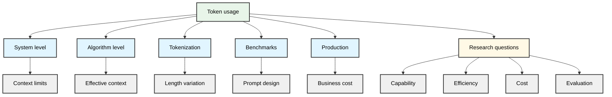
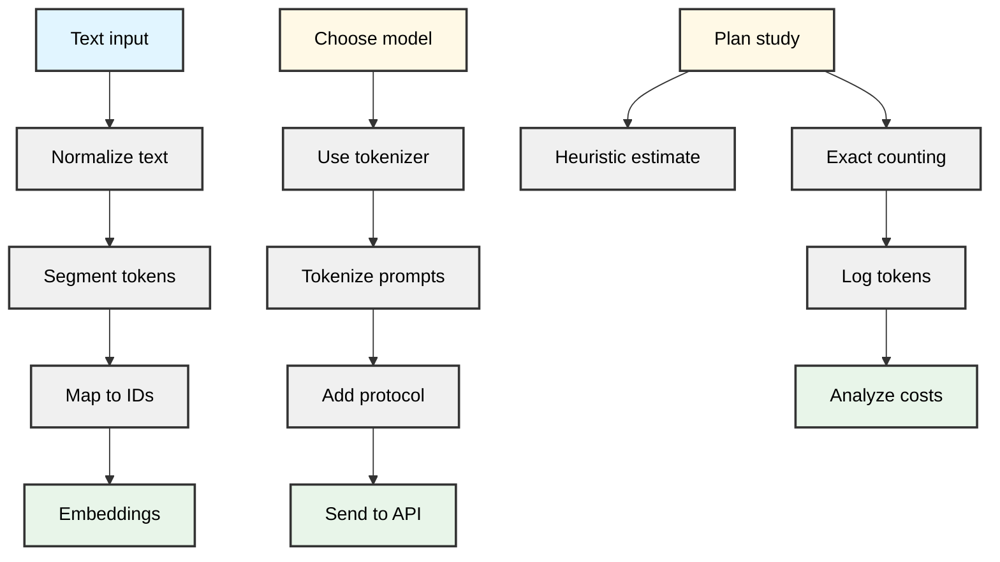
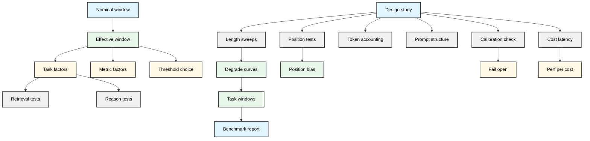
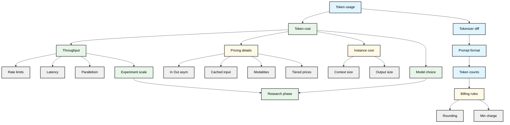

# LLM token usage 

## Introduction: Why Token Usage Matters for LLM Research

Token usage is the central accounting unit for how contemporary large language models are built, priced, and evaluated in practice. Every interaction with an LLM—whether a research benchmark, a fine-tuning experiment, or a production deployment—ultimately reduces to sequences of tokens being transformed into other sequences of tokens. Because models are provisioned, billed, and constrained in token terms, treating token usage as a first-class abstraction provides a single lens for comparing model capability, efficiency, cost, and empirical methodology (how we design and interpret experiments). The same retrieval-heavy prompt that boosts benchmark accuracy by adding chain-of-thought reasoning and extra documents may be economically untenable at production scale once multiplied over millions of users.

At the systems level, tokens are the unit of work—the basic resource consumed by each request. Modern frontier models expose context windows on the order of hundreds of thousands of tokens and price input, cached input, and output separately, with output tokens often costing an order of magnitude more than input tokens in public APIs [web_3_3]. For example, a model might support a 400k-token context while charging roughly \$1–\$2 per million input tokens and around \$10 per million output tokens, with discounted pricing for cached segments [web_3_3]. These details fix hard boundaries: how much state can be carried in the system prompt, how expensive it is to generate long chains of reasoning, and where per-request token limits start to dominate product design.

Beyond system-facing constraints, at the algorithmic level tokens define the granularity at which information competes for attention inside the model. The “maximum context window” advertised by providers is not the same as the maximum *effective* context that reliably influences predictions; empirical work has shown that model performance can degrade as more distant tokens are added or as prompts approach nominal limits, even though those tokens technically fit in the window [acad_2_1]. This means that the *distribution* of tokens within a prompt—what information is placed where, and how much of it there is—affects both accuracy and robustness, not just latency and cost.

Tokenization itself adds another layer of complexity. Different models and providers use different tokenization schemes, and the same natural-language input can correspond to substantially different token lengths across systems, as measured in comparative token-count studies [acad_2_3]. A prompt that fits comfortably within one model’s context window might be truncated or heavily compressed for another, even when the surface text is identical. For cross-model evaluation, this variation is not just a bookkeeping nuisance: it changes the effective information budget per example and can bias comparisons if not explicitly controlled.

These token-level considerations show up directly in how we design and interpret benchmarks. The same benchmark, expressed with different prompt templates or formatting choices, can vary by multiples in token count—for example, adding chain-of-thought explanations or verbose instructions—altering both the effective difficulty (via context-length effects) and the economic cost of replication. “Prompt engineering” is often described qualitatively, but in practice it is also a resource-allocation problem: how many tokens are spent on instructions, demonstrations, retrieved documents, or tool traces per query, and what is the marginal gain per additional token? Research that ignores these asymmetries can easily produce experiments that look impressive on paper but are economically infeasible or poorly aligned with real deployment constraints.

For practitioners bridging research and production, token usage is where methodological choices intersect with business constraints. API pricing is denominated per million tokens for most major providers, with separate rates for input, cached input, and output [web_3_3]. Adding more documents, more chain-of-thought steps, or more tool traces often looks like “free” capability gains but actually spends additional tokens that must be justified both empirically (does this really improve reliability on the target distribution?) and operationally (does the gain survive under realistic traffic and budget?). A prompt policy or retrieval strategy that improves a benchmark score by a few points may double per-user serving costs or exhaust latency budgets once deployed at scale.

For these reasons, treating tokens as the fundamental resource is not just an implementation detail; it is a unifying abstraction that links several questions researchers care about:

- **Capability:** What behaviors can a model express under a given token budget and tokenization scheme?
- **Efficiency:** How can we structure prompts, retrieval, and tool use to maximize utility per token?
- **Cost:** How do these design choices translate into concrete dollar and latency budgets in real systems [web_3_3]?
- **Evaluation:** How should we report and normalize results so that token usage is comparable across models, prompts, and deployments [acad_2_3]?

By treating token usage as a first-class object of study, we can better align research practice with the real operational constraints of LLMs and design evaluations that more reliably predict performance in the environments where these models actually run [acad_2_1].

## Foundations of LLM Tokenization and Token Accounting

Modern LLMs typically do not operate directly on characters or words. Instead, they map text into sequences of discrete integers called tokens, and all subsequent computation happens on these token IDs. For example, the string “Large language models.” might become three tokens for one model (`["Large", " language", " models."]`) and five for another (`["Large", " language", " model", "s", "."]`). From the model’s perspective it never sees the original text—only these integer sequences. The rest of this section summarizes how this mapping works, how tokenizers differ across models, and how to handle token counts rigorously in research workflows.

### From text to token IDs

Most contemporary LLM tokenization pipelines can be decomposed into three conceptual stages:

1. **Text normalization**

   Raw text is first normalized into a canonical form. This may involve:

   - Unicode normalization (e.g., NFC/NFKC).
   - Lowercasing (for some legacy tokenizers).
   - Standardizing whitespace.
   - Handling special characters and control codes.

   Some popular tokenizers—especially byte-level BPE variants used in GPT-style models—apply minimal normalization and instead operate directly on bytes, which allows them to robustly handle arbitrary Unicode but can increase the number of tokens for some scripts.

2. **Segmentation into token units**

   The normalized text is then segmented into subword-like units according to a learned vocabulary. Common schemes include:

   - **Byte Pair Encoding (BPE)**: starts from individual bytes or characters and iteratively merges the most frequent adjacent pairs into larger units (e.g., “mod” + “el” → “model”). Deterministic at inference.
   - **WordPiece**: similar to BPE but optimizes a likelihood-based objective over the training corpus; also deterministic at inference.
   - **Unigram language model tokenization**: trains a probabilistic model over a set of candidate subwords; training is probabilistic, but the chosen segmentation at inference is typically the most probable one, hence deterministic.

   These algorithms all trade off vocabulary size against fragmentation. Frequent words or morphemes tend to be single tokens; rarer or morphologically complex forms are broken into multiple subwords. For instance:

   - “model” → `["model"]`
   - “strawberry” → `["straw", "berry"]` on many English-focused tokenizers
   - “models.” might become `["model", "s", "."]`, showing that punctuation and word-final affixes often become separate tokens even when there is no space boundary.

3. **Mapping to integer IDs**

   Each token unit is then mapped to a unique integer ID via a vocabulary table. Special tokens (e.g., beginning-of-sequence, end-of-sequence, system or role markers in chat formats) are also assigned reserved IDs.

   At the first model layer, these IDs are converted to continuous vectors by an embedding layer. From that point on, all computation is continuous; when we talk about “token counts” in practice, we are referring to what happens at this text-to-token interface, not to operations inside the model.

### Tokenizers differ by model and vendor

Different models and vendors ship different tokenizers, even when they are based on similar subword schemes. This has direct implications for cost, context usage, and evaluation design.

#### Same text, different token counts

The same input string can yield different tokenizations and token counts across models. For example, a 1,000-character abstract might be:

- 180 tokens for a model with a large, English-optimized vocabulary.
- 260 tokens for a model using a smaller or more byte-level vocabulary.

This matters because context windows and billing are typically specified in tokens. A benchmark that allocates “2,048 tokens” of context implicitly advantages models with more efficient tokenization: they effectively “see” more of the text than models that need more tokens to represent the same content. For throughput or cost comparisons, this means that “tokens per second” and “cost per 1M tokens” are always tied to a particular tokenizer.

Public token calculators and vendor tools illustrate these discrepancies in practice, often showing substantially different token counts for identical text across GPT, LLaMA, Claude, Gemini, and other models.[web_1_1][acad_2_3]

#### Language- and domain-specific tokenization efficiency

Tokenization efficiency—the number of tokens required to represent a fixed amount of information—varies across languages and domains.[acad_1_2][acad_1_3] For example, a single Ukrainian word may be split into three to five short subword tokens where an English equivalent might be one or two tokens.[acad_1_2][acad_1_3] Similar issues arise for other morphologically rich languages and for domains like code or mathematical notation.

In multilingual or cross-domain experiments, this variation can act as a hidden confounder: models may appear to perform worse simply because they expend more of their fixed context window on representing the same content, leaving fewer tokens for additional evidence, instructions, or chain-of-thought.

#### Instruction and system-message overhead

Chat-style APIs add structured metadata (roles, separators, hidden system prompts) around user content. These protocol elements consume tokens even though they are not visible in the plain-text prompt. Providers often do not fully document the exact internal templates, so empirically reproducing token counts requires using official tokenization tools or directly inspecting API responses.[acad_2_3]

This overhead is non-trivial when conversations involve many short turns or complex system prompts. It reduces the fraction of the context window available for task-relevant content and contributes to per-token billing.

For research workflows, using the canonical tokenizer tied to the exact model and interface (e.g., specific version of a chat API vs. a base completion model) is essential. This usually means using the tokenizer shipped in the official SDK or explicitly referenced in the model card, rather than a “similar” open-source tokenizer.

### Why tokenization matters for research

Tokenization is easy to treat as a low-level implementation detail, but it has direct methodological consequences.

- **Counting and reasoning tasks**

  LLMs show systematic failures on simple symbol-counting problems, such as counting the number of occurrences of a character in a word (“How many ‘r’ characters are in ‘strawberry’?”).[acad_1_1] Tokenization granularity is one of several hypothesized contributors to this behavior. For example, if “strawberry” is segmented as `["straw", "berry"]`, there is no single token corresponding to the full character sequence; the model must infer character-level structure indirectly from subword embeddings.[acad_1_1]

  Tokenization is not the sole cause—network architecture, attention patterns, and training objectives also matter—but when designing counting or compositionality benchmarks, it is important to be aware of how test items decompose into tokens.

- **Cross-model comparisons**

  Because tokenization differs, reported metrics like “tokens per second,” “context length,” or “cost per 1M tokens” are not directly comparable across models. In cross-model evaluations:

  - Treat token counts as model-specific quantities.
  - Where appropriate (e.g., for throughput or compression analyses), consider normalizing by characters or bytes instead of tokens.
  - When publishing, state explicitly which tokenizer and model version were used for all token-based metrics.

- **Multilingual and domain adaptation studies**

  In multilingual, cross-domain, or cross-script settings, tokenization efficiency can act as a hidden confounder in both performance and cost analyses.[acad_1_2][acad_1_3] For instance, if one model’s tokenizer is substantially more efficient for Ukrainian legal text than another’s, it may effectively access more evidence within the same token budget. Experimental designs should either:

  - Control for this by fixing character/byte budgets rather than token budgets, or
  - Explicitly analyze how tokenization efficiency varies across conditions and interpret performance differences in that light.

### Practical token counting in workflows

In practice, most research questions about tokens reduce to a few concrete concerns: how many tokens an experiment will use, how much this will cost, and whether results are reproducible across runs and models.[acad_2_3]

#### Use the vendor’s or canonical tokenizer implementation

For any given model, use the tokenizer implementation tied to that exact model and interface (including differences between chat and completion APIs). This is usually provided via:

- Official SDKs or libraries (e.g., vendor-specific tokenization utilities).
- Model cards specifying a SentencePiece, BPE, or other tokenizer to use.

Open-source tools such as `sentencepiece`, `tokenizers`, and others can be appropriate when they exactly match the model’s tokenizer configuration; otherwise they are best treated as approximations.[acad_2_3]

When reporting results, record the tokenizer name, version, and relevant configuration (e.g., vocabulary size, normalization settings). Tokenizers can evolve between model releases, which can affect both counts and behavior.

#### Tokenize inputs before sending them

For controlled experiments, tokenize prompts offline before sending them to the model. This allows you to:

- Enforce hard limits (e.g., truncate or adapt prompts to a fixed token budget).
- Stratify datasets by input length.
- Detect unexpectedly long examples early.

Be aware that, for some providers, there can be subtle differences between offline tokenization tools and the production tokenizer. Validating a small sample of prompts by comparing offline counts with actual API-reported usage helps ensure alignment.[acad_2_3]

#### Account for protocol overhead

When using chat or structured APIs, account not only for prompt content but also for:

- System messages and hidden instructions.
- Role markers (e.g., “user,” “assistant”).
- Separator and control tokens inserted by the API.

For example, some APIs add a few extra control tokens around each message, so a conversation with many short turns can be surprisingly expensive relative to a single long message with the same total characters.[acad_2_3] Empirical measurement—e.g., via provider usage reports—is often necessary to quantify this overhead.

#### Track both input and output tokens

Token budgets and costs depend on both input (prompt) and output (completion) tokens. In experiments where output lengths vary across conditions (e.g., short vs. long explanations), failure to track completion tokens can bias cost and latency comparisons, even when input prompts are matched.[acad_2_3]

Where possible, log:

- Input token count.
- Output token count.
- Total tokens (input + output).

This enables post hoc analyses of trade-offs between performance, response length, and cost.

#### Centralize token accounting

Rather than scattering ad hoc token counting code across scripts, centralize token accounting in a dedicated module or service that:

- Wraps all model calls (local or API).
- Logs per-request token counts and costs.
- Aggregates statistics per dataset, per experiment, and per condition.
- Records the tokenizer and model versions used.

This simplifies budgeting, supports reproducibility, and makes it easier to compare results across experiments or models later.[acad_2_3]

### Estimation vs. exact counts

Token counts can be approximated heuristically or computed exactly. The appropriate choice depends on the stage of the project.

#### Heuristic estimates

Rough estimates such as “1 token ≈ 3–4 characters in English” or “1 token ≈ 0.75 words” are sometimes used for quick feasibility checks. These are acceptable for early-stage back-of-the-envelope planning but can break down badly:

- For morphologically rich or non-Latin languages, tokens per word can easily be 2–3× higher than such heuristics suggest.[acad_1_2][acad_1_3]
- Code, mathematical formulas, and heavily punctuated text often produce many more tokens than naive character-based rules imply.

Consequently, heuristic estimates should not be used for final budgeting, pricing, or reporting.

#### Exact accounting

For precise work—especially when publishing results or allocating significant budgets—use exact token counts:

- Run the full prompts (including any system instructions and protocol wrappers) through the same tokenizer library used by the model API or inference stack.
- Use these counts directly to enforce context limits, compute costs, and report metrics.[acad_2_3][web_1_1]
- Periodically validate that local counts match provider-reported usage on a sample of calls, to detect any divergence due to tokenizer changes or API-side templates.

Public token calculators and guides can be useful reference points, but they are supplements, not substitutes, for using the exact tokenizer associated with the specific model and deployment you are studying.[web_1_1][acad_2_3]

## Context Windows, Effective Context, and Empirical Limits on Token Usage

Modern APIs advertise “400k token context windows” and similar figures, but this number primarily describes an *engineering* limit: the maximum sequence length the interface will ingest and process in a single call.[web_3_3] It does not, by itself, specify how much of that sequence the model can *use* reliably for a given task. In practice, there is a gap between the *nominal* context window and the *effective* context window, and understanding this gap is critical for both experimental design and benchmarking.

### Nominal vs. effective context

By *nominal context window* we mean the maximum number of tokens the system will accept in a single request, including all system, tool, and user input tokens plus any reserved output tokens.[web_3_3] This is a property of the serving stack and model configuration: an upper bound enforced by the API, not a performance guarantee.

By *effective context window* we mean the largest context length at which a model’s performance on a specified task, under a chosen metric, remains above a predefined threshold.[acad_2_1] Effective context is therefore:

- **Task-dependent** (e.g., factual retrieval vs. multi-step reasoning),
- **Metric-dependent** (e.g., accuracy vs. calibration),
- **Threshold-dependent** (e.g., “no more than 5% degradation vs. short-context baseline”).

Paulsen formalizes this notion and proposes position-controlled tests to estimate maximum effective context windows for different tasks.[acad_2_1] In what follows, “effective” should be read as referring to the *cognitive capacity of the model’s attention and internal representations*—how far into the sequence the model can still reliably encode, retrieve, and reason over relevant information.

### How performance degrades with long inputs

Empirically, several regularities appear as sequence length grows, across both controlled evaluations and practitioner reports in long-document question answering and large-repository code navigation systems.[acad_2_1][acad_2_2]

#### Position-dependent recall

Performance typically displays strong *position bias*: information at the very beginning (primacy region) and the very end (recency region) of the sequence is more reliably used than information in the middle.[acad_2_1] Position-controlled benchmarks—where the same key fact is placed at different absolute and relative positions—show systematic degradation in recall as the fact moves away from these privileged regions.[acad_2_1]

This is consistent with production observations: models can often retrieve a function or definition if it appears near the top or bottom of a file, but may “forget” semantically central material buried in the middle of long documents or code files.[acad_2_2]

#### Task-dependent decay curves

The rate and shape of degradation depend strongly on the task:[acad_2_1][acad_2_2]

- **Simple retrieval** (e.g., “What is the value of X?” where X appears verbatim once) can remain robust until a large fraction of the nominal window is filled, then show a noticeable transition as the relevant token drifts into regions the model represents poorly.
- **Pattern matching and local inference** (e.g., “Does this document mention both A and B?”) often degrade earlier, as the model must integrate signals that may be separated by thousands of tokens.
- **Global, multi-step reasoning** (e.g., synthesizing arguments across multiple sections or files) can fail at much shorter effective lengths, even when simple retrieval remains intact, indicating that encoding and retrieval capacity outstrip reliable composition and reasoning.

In many setups, the performance curve is not purely smooth: one can observe regimes of relatively stable accuracy followed by a sharp drop once the information lies outside the model’s practical attention span for that task.[acad_2_1]

#### Competition for attention and interference

As context grows, relevant and irrelevant material compete for limited representational capacity. Long inputs with repeated entities or overlapping topics tend to produce *interference*: spurious but locally salient cues (e.g., a recent but irrelevant mention of an entity) dominate over globally correct evidence that appears earlier.[acad_2_2] This effect is particularly pronounced in code (e.g., multiple functions with similar names across files) and in documents with repetitive structure.

#### Prompt formatting and structure effects

Prompt structure can significantly modulate effective context. Clear sectioning, explicit indices, and consistent tagging (e.g., “File 3: …”, “Section B: …”) help the model maintain referential coherence over long ranges and reduce interference.[acad_2_1] Poorly structured or noisy prompts effectively shrink the usable context: although tokens fit within the nominal window, a smaller fraction contributes meaningfully to solving the task.

#### Non-monotonic failure modes and calibration

Failure modes at long context are often *non-monotonic*: models do not simply “refuse” when overwhelmed. Instead, they may continue to produce fluent, specific answers even when key evidence is missing or has been displaced beyond their effective range. Practitioners sometimes describe this as models “failing open” (i.e., emitting confident outputs instead of degrading to an explicit uncertainty or abstention response), especially at or beyond their effective context limits. To our knowledge, this specific behavior is mainly documented in practitioner reports rather than in standardized benchmarks.

This has direct consequences for evaluation. Raw correctness (e.g., accuracy) is insufficient; one must also examine *calibration*: when the model is wrong at long context, does it signal uncertainty, or does it present errors as high-confidence facts?

Collectively, these phenomena imply that the “400k token” engineering envelope can be much larger than the *effective context window* for non-trivial tasks. The usable portion of the nominal window is shaped by position, task, prompt structure, and interference, rather than by the hard protocol limit.[acad_2_1][web_3_3]

### Implications for experimental design

Given the gap between nominal and effective context, experiments that simply state “we used the full 400k window” are under-specified. For reproducible, interpretable studies, several practices are useful.

#### Report both nominal and effective context

At minimum, report:

1. **Nominal max tokens** (input + reserved output) supported by the API/model.[web_3_3]  
2. **Range of context lengths actually tested** (e.g., 4k, 16k, 64k, 256k).  
3. **Estimated effective context window per task and metric**, following a clear definition (e.g., “maximum length with ≤5% drop vs. 4k baseline accuracy”).[acad_2_1]

This basic template makes it easier to compare different studies and prevents readers from conflating UI limits with task-level capabilities.

#### Use position-controlled benchmarks

Where possible, adopt or construct benchmarks that vary *where* in the sequence the critical information appears, holding other factors constant.[acad_2_1] For example:

- Insert a key fact at different absolute positions (token 1k, 50k, 200k).
- Vary relative position (beginning, middle, end) while keeping total length fixed.

This directly exposes the position-dependent decay and primacy/recency effects described earlier, and it allows you to quantify not just “how long” a context can be, but *where* within that context the model remains reliable.

#### Differentiate retrieval from reasoning

Design tasks that separately probe:

- **Retrieval capacity**: ability to locate and restate information somewhere in the context (metrics: retrieval accuracy, hit rate).[acad_2_1]
- **Reasoning/composition capacity**: ability to integrate multiple pieces across the context into a correct, coherent answer (metrics: task accuracy, chain-of-thought consistency, multi-hop success rates).[acad_2_2]

Estimating effective context windows for these dimensions separately highlights that a model may “remember” facts far into the sequence yet fail to use them correctly in complex reasoning.

#### Control for tokenization and counting

Tokenization differences can create misleading cross-model comparisons: the same character sequence can consume very different token budgets under different tokenizers, especially for non-English languages, code, or compressed formats.[acad_2_3] For example, a Japanese paragraph or minified JavaScript snippet may be short in characters but long in tokens for some models.

When designing experiments and reporting results:

- Specify the tokenizer used for each model.[acad_2_3]
- Where possible, align comparisons by *semantic* length (e.g., characters, sentences, code lines) in addition to raw tokens.
- Clearly state whether context lengths refer to *input only* or to input plus reserved output.

#### Account for prompt engineering and summarization

There is tension between evaluating “raw” model capabilities and evaluating realistic systems that rely on prompt engineering, chunking, or intermediate summarization layers.

To make studies interpretable:

- Explicitly document any pre-processing (segmentation rules, summarizer model, retrieval heuristics) and how they scale with context length.[acad_2_1][acad_2_2]
- Distinguish baselines that present the *entire* document vs. baselines that present only retrieved or summarized subsets.
- Be clear whether your effective context estimates are for the *base model* or for a *system pipeline* (model + retriever + summarizer).

#### Measure calibration and robustness, not just accuracy

Long-context evaluations should go beyond single-shot accuracy and include:

- **Calibration**: e.g., Brier score or expected calibration error (ECE) over model confidences, when available, stratified by context length.
- **Robustness to perturbations**: performance under small changes to irrelevant parts of the context (reordering, insertion of distractors) vs. to relevant parts (moving or paraphrasing key evidence).
- **Consistency**: agreement across runs with different seeds or document instantiations at the same length.

These measures expose “fail open” behavior and interference patterns that raw accuracy curves can obscure.

#### Include compute and latency as outcome variables

Long-context use is expensive. Per-token costs and latency often grow roughly linearly with sequence length.[web_3_3] When evaluating methods that exploit very long context, include:

- **Compute/financial cost**: e.g., performance per dollar at given lengths, using published pricing.[web_3_3]
- **Latency**: performance per unit latency where interactive or real-time constraints matter.

This allows a more realistic assessment of whether using the far end of the nominal window is preferable to architectural alternatives (e.g., retrieval-augmented generation with shorter context).

### Implications for benchmarking and comparisons

Benchmarking long-context models requires aligning protocol limits, task demands, and effective context estimates.

#### Context-length sweeps with controlled variability

Benchmarks should perform explicit *length sweeps*—evaluating performance at multiple, well-chosen context sizes (often log-spaced: 4k, 8k, 16k, 32k, …)—rather than testing only at the nominal maximum. For each length, use multiple documents or seeds to reduce variance and produce stable degradation curves.[acad_2_1]

Such sweeps should:

- Keep task difficulty as constant as possible aside from length.
- Vary both total length and position of the critical evidence.
- Report both mean performance and confidence intervals across instances.

#### Task-specific effective windows

Within a single benchmark, effective context windows may differ across subtasks—for example, retrieval vs. reasoning components of a combined pipeline.[acad_2_1][acad_2_2] Benchmarks should therefore:

- Report separate effective windows for each subtask and metric (e.g., retrieval accuracy vs. reasoning accuracy).
- Avoid collapsing results into a single “max usable context” number for the entire model.

This discourages over-simplification and clarifies what parts of a complex task actually benefit from extended context.

#### Model- and domain-specific token accounting

Effective context results in one domain (e.g., code) do not necessarily transfer to another (e.g., conversational or legal text). Differences in tokenization, structure, and redundancy all affect interference and decay dynamics.[acad_2_2][acad_2_3] Benchmarks should:

- Treat domains explicitly: report separate curves and effective windows for code, natural language, and mixed inputs.
- Use domain-appropriate length scales (e.g., files and functions for code; sections and documents for text) alongside tokens.

This makes it easier to reason about how far into a typical file or document a model can operate reliably, beyond raw token counts.

#### Transparent failure analyses

Finally, benchmarking should include qualitative and quantitative failure analyses at long context. Rather than isolated anecdotes, aim for *failure taxonomies* such as:

- Missed central evidence (model ignores the key passage).
- Middle-of-document amnesia (strong primacy/recency, weak mid-context recall).
- Spurious cross-file links (hallucinating connections between unrelated segments).

Annotating and categorizing such failures across lengths clarifies how and where effective context breaks down, and which mitigation strategies (prompt structure, retrieval, summarization) are most promising.

In short, treating “400k context” as a binary capability obscures the key experimental variable: for a given task, metric, and setup, how much of that nominal window constitutes the model’s *effective* context—i.e., the range over which it can use information reliably and robustly.[acad_2_1][web_3_3]

## Token Usage, Cost Models, and Cross-Provider Comparisons

Token accounting is fundamentally an economic problem: for a fixed research budget, you trade off model quality, latency, and experiment scale against per‑token prices, context limits, and rate caps. For any given workload, that trade‑off looks different across providers, even when headline specs (“1M context,” “cheap tokens”) appear similar. This section focuses on how token usage translates into dollars and throughput, and how heterogeneous pricing models should inform research design and model selection.

### From tokens to dollars and throughput

Most providers bill separately for input and output tokens, usually quoted as dollars per million tokens:

\[
\text{Cost} \approx \frac{p_{\text{in}} \cdot T_{\text{in}} + p_{\text{out}} \cdot T_{\text{out}}}{10^6}
\]

where \(T_{\text{in}}\) and \(T_{\text{out}}\) are input and output token counts, and \(p_{\text{in}}, p_{\text{out}}\) are their respective prices. [web_1_2][acad_2_3]

A concrete example anchors this:

- Suppose a model charges \$2/M input and \$8/M output.
- A run with 50k input tokens and 5k output tokens costs
  \[
  \frac{2 \times 50{,}000 + 8 \times 5{,}000}{10^6}
  = \frac{100{,}000 + 40{,}000}{10^6} \approx \$0.14.
  \]

In practice:

- Long prompts (few‑shot examples, system instructions, retrieval context) often dominate input cost. [acad_2_3]
- Generative workloads (multi‑paragraph summaries, code synthesis, multi‑turn dialogue) can make output cost a major driver, especially on models that price output much higher than input. [web_3_3]
- Asymmetric pricing (cheap input, expensive output) makes short, well‑constrained outputs (classification, scoring) much cheaper than free‑form generation on the same model. [web_3_3]

Beyond per‑request cost, token budgets indirectly constrain how quickly you can run experiments. Throughput is typically constrained by:

- **Rate limits.** Providers cap tokens per minute (TPM) and/or requests per minute (RPM) per account or per model. This bounds how many experimental instances you can process before a deadline, even if you are willing to pay more. [web_3_1]
- **Model latency.** Slower, larger models may offer better quality but reduce the number of runs you can complete within a fixed time window.
- **Parallelism.** Some providers allow high concurrency; others enforce stricter per‑connection or per‑project limits. Effective throughput is often
  \[
  \text{Throughput} \approx \min(\text{TPM limit}, \text{concurrency} \times \text{speed per call}).
  \] [web_3_1]

For research planning, it is useful to estimate both **expected dollars per instance** and **maximum instances per hour** for each candidate model.

### Heterogeneous pricing models and their research impact

While the basic “dollars per million tokens” framing is universal, the details vary substantially across providers and models. Comparative surveys show wide spreads not only in headline prices, but in how tokens are classified and discounted. [web_3_1][web_3_2][web_8_1]

Key dimensions:

- **Input vs. output asymmetry.** Some models price output tokens several times higher than input tokens. For example, a model might charge \$1.25/M input tokens, \$0.13/M cached input tokens, and \$10/M output tokens. [web_3_3] For research tasks with long generations (e.g., chain‑of‑thought, code diffs, multi‑document summaries), this asymmetry can dominate total cost.
- **Cached or repeated input discounts.** Some, but not all, providers discount “cached” input—tokens that repeat across calls, such as a long instruction prefix or shared context. [web_3_3] A benchmark harness that reuses a 10k‑token instruction block across thousands of calls may be 2–3× cheaper on a provider with aggressive cached‑input discounts than on one that charges full price each time, materially affecting which provider is optimal for that workload.
- **Special tokens and modalities.** Vision, audio, or tool‑calling tokens may be priced differently from plain text, sometimes with separate quotas. For example, image inputs may be converted into a large number of internal “vision tokens,” billed on a different schedule from text, even though they share a unified context window. [web_3_1]
- **Tiered pricing and volume discounts.** Some providers reduce per‑token prices beyond certain monthly volumes or for reserved capacity, which can be decisive for large‑scale evaluation campaigns. [web_3_2][web_8_1]

For researchers, these heterogeneities mean that **cost per experimental condition** cannot be inferred from headline “per‑M token” figures alone. You need to match provider pricing mechanics to your task profile (prompt length, output length, reuse of context, and modality mix) before committing to a model family.

### Cross‑provider differences that affect experimental design

Cross‑provider comparisons are often framed in terms of accuracy metrics or benchmark scores, but for experimental design, three cost‑related aspects are equally important: effective cost per task instance, usable context, and rate limits. Comparative analyses of major APIs show that these factors vary as much as raw price. [web_3_1][web_3_2][web_8_1]

#### 1. Effective cost per “task instance”

For a given evaluation instance, a rough cost estimate is

\[
\text{Instance cost} \approx \frac{p_{\text{in}} \cdot L_{\text{ctx}} + p_{\text{out}} \cdot L_{\text{out}}}{10^6},
\]

where \(L_{\text{ctx}}\) is average context length (prompt + retrieved docs + prior turns) and \(L_{\text{out}}\) is average output length. [web_1_2][acad_2_3]

In practice:

- Multi‑shot or RAG‑style evaluations that include several thousand prompt tokens per instance can be costly even with short answers.
- Experimental setups with multiple seeds, temperatures, or self‑consistency samples multiply instance cost directly.
- When comparing models, you should normalize not just by “tokens processed,” but by **tokens required to achieve a given performance level**, since some models may need longer prompts (e.g., more few‑shot examples or instructions) to match a stronger model’s performance.

#### 2. Context window, truncation risk, and usable tokens

Providers advertise maximum context windows (e.g., 32k, 128k, 400k tokens), but **usable** context is often smaller due to:

- System‑reserved tokens for internal metadata and safety scaffolding.
- Provider‑specific chat formatting overhead (role labels, JSON wrappers, etc.).
- Max output constraints, which reduce how much of the window can be safely allocated to input.

These differences affect long‑document and retrieval‑augmented experiments. [acad_2_3] For retrieval‑heavy evaluations or multi‑document reasoning, a slightly more expensive model with a larger and more reliable context window can reduce engineering overhead (chunking, truncation logic) and lower the risk of silent context loss, which in turn improves result reliability.

#### 3. Rate limits, parallelism, and deadline‑driven research

Providers differ widely in tokens‑per‑minute caps, per‑model vs per‑account limits, and burst behavior. [web_3_1] For research, this matters when you need to:

- Run large sweeps (hyperparameter grids, prompt variants, ablations) before a submission deadline.
- Re‑run entire evaluation suites after a prompt change or model update.
- Support shared usage across a lab under a single account.

A concrete implication: if Provider A is 2× cheaper per token but has 5× lower TPM limits and stricter concurrency caps than Provider B, the slower provider may still be worse for running thousands of experiments in a short review cycle, even though nominal per‑token costs are lower.

### Token policies, measurement, and reproducibility

Token policies and tokenization details are easy to overlook but critical for reproducible evaluation. [acad_2_3]

#### Tokenizer differences

Each provider uses its own tokenizer; “1,000 words” can map to substantially different token counts across models, sometimes diverging by 20–30% depending on language and formatting. [web_1_2][acad_2_3] This has several consequences:

- Cross‑model comparisons based on “n tokens per prompt” are only meaningful if token counts are measured per model rather than assumed from character counts.
- Reproducing results requires documenting not just prompts but tokenization behavior (or at least model versions), since tokenization changes can alter truncation points and effective input.

#### Prompt formatting overhead

APIs wrap prompts in provider‑specific schemas (chat messages, function‑calling descriptors, tool metadata). This wrapper is often non‑trivial in token cost. [web_1_2]

For reliable budgeting:

- Use provider token‑count APIs or offline tokenizers on representative prompts rather than guessing.
- Include system messages, tool specs, and any automatically inserted scaffolding in your measurement.
- When migrating a benchmark from one provider to another, re‑measure token counts; identical textual content can lead to different effective context usage and truncation behavior.

#### Rounding, minimum charges, and billing granularity

Billing is often rounded to some token quantum (e.g., nearest 1,000 tokens) or subject to minimum per‑request charges. [web_1_2] For small prompts, rounding effects can dominate:

- If billing rounds to 1,000‑token blocks, a 50‑token request and a 900‑token request cost the same.
- Batched or concatenated evaluation instances may therefore be more cost‑efficient than many tiny calls, provided they do not hit context or latency constraints.

From a methods perspective, logging exact token counts per request—using provider introspection when available—is as important as logging prompts and model versions, and should be part of your standard experimental metadata. [web_1_2][acad_2_3]

### Implications for model selection and scaling in research

Token usage, pricing mechanics, and rate limits combine to define which models are viable for a given research phase.

- **Exploration / prototyping.** Smaller, cheaper models or discounted endpoints let you try more prompts and ablations per dollar. Even at this stage, basic token accounting helps you estimate how many variants you can realistically test under a fixed exploratory budget. [web_3_1][web_3_2]
- **High‑fidelity evaluation.** When running careful benchmarks on stronger models, explicit cost formulas and measured token counts ensure that the number of evaluation runs remains within budget while preserving statistical power (e.g., enough examples and seeds per condition to detect meaningful differences). [web_1_2][acad_2_3]
- **Large‑scale deployment or behavioral studies.** At scale, small price differences compound. Models with slightly lower raw performance but substantially cheaper tokens can enable 5–10× larger sample sizes for the same spend, often yielding more robust conclusions about behavior or robustness. Cross‑provider comparisons show that these cost/performance trade‑offs vary widely and can change over time as new models are released. [web_3_1][web_3_2][web_8_1]

Integrating token counting and cost estimation into your tooling—from prompt design to evaluation scripts—lets you treat cost and throughput as first‑class experimental design parameters, rather than ad‑hoc constraints discovered only after the cloud bill arrives.

## Advanced Strategies to Optimize Token Usage in Research Pipelines

Token usage is not just a budget line; in research pipelines it directly shapes what evidence the model can see, how reproducible analyses are, and which errors you are likely to miss. Input and output tokens together determine both cost and latency, but also effective “attention bandwidth” for your pipeline. [acad_2_3] Organizing this bandwidth carefully can reduce expenditure while maintaining, or sometimes improving, inferential quality when evaluated against held‑out tasks or benchmarks.

In what follows, techniques are organized into five layers: (1) prompt and schema design, (2) context‑side compression, (3) retrieval optimization, (4) pipeline‑level/meta optimization, and (5) routing and representation design, followed by practices to safeguard research validity. Throughout, the emphasis is on reallocating tokens where they add measurable value rather than cutting blindly.

### 1. Structuring prompts for reusable, compact instructions

#### 1.1 Stable “contracts” vs. task‑specific details

A simple but effective pattern is to separate stable instructions (“how this agent behaves”) from task‑specific details (“what to do this time”). Instead of repeating long methodological guidance in every call, you define:

- A concise, reusable system contract (e.g., inclusion criteria, tone, citation rules).
- A short task block with the current question or document.
- Optional run‑time flags (e.g., “strict mode: only include RCTs”).

In tools or agents where you control orchestration, this is effectively “prompt caching”: the stable contract is stored once and only a small delta changes per call. This typically cuts instruction tokens by tens of percent in multi‑step research workflows without reducing methodological clarity, provided you verify equivalence on a validation set of tasks. [web_2_2] [web_9_2]

#### 1.2 Schema‑based outputs instead of free text

For many research subtasks—screening abstracts, coding survey responses, extracting PICO elements—free‑form answers both waste tokens and complicate downstream analysis. Defining a compact output schema (JSON, CSV row, or a short tag sequence) lets you:

- Eliminate verbose restatements of the question.
- Encode multiple decisions in a few tokens (e.g., `{"include": "no", "reason": "wrong population"}`).
- Parse and aggregate results programmatically.

Case studies in cost‑optimization routinely report substantial token reductions when outputs are constrained to schemas, often with improved consistency in coding tasks when evaluated against human‑labeled benchmarks. [web_2_2] [web_9_2] This tends to preserve validity because the structure forces the model to commit to explicit, comparable judgments rather than diffuse prose.

A minimal before/after illustration for abstract screening:

- Before (free text):  
  “After reviewing the abstract, I would exclude this study because it does not involve adult participants with type 2 diabetes…”

- After (schema):  
  `{"include": "no", "primary_reason": "population_mismatch"}`

When you validate both prompts on a sample of abstracts, you often find equivalent or better agreement with human decisions, at far lower token cost.

#### 1.3 Compositional prompts across pipeline stages

Breaking complex analyses into smaller steps (e.g., “summarize → classify → synthesize”) can look expensive, but compositional prompts reduce redundancy:

- Reuse a compact representation (e.g., a 120‑token structured summary) across multiple downstream steps instead of re‑sending the full abstract or transcript.
- Keep each sub‑prompt minimal, assuming shared conventions from the stable contract.
- Pass short, explicit intermediate state (e.g., numeric confidence scores) instead of narrating reasoning repeatedly.

This compositional design supports validity because you can unit‑test each step against its own benchmark (e.g., summary fidelity, classification F1), ensuring that token reductions at one stage do not silently degrade overall pipeline performance.

### 2. Compression and context optimization

Optimizing the context the model sees is where the largest raw token savings often occur. The challenge for research is to shrink context without erasing critical evidence or provenance.

#### 2.1 Heuristic vs. learned compression

Context compression ranges from simple heuristics to learned models:

- Heuristic compression: rules or classic IR techniques such as TF‑IDF pruning, sentence‑level similarity thresholds, or keeping only sections matching query keywords.
- Learned compression: smaller LLMs or summarization models trained or tuned to produce short, answer‑oriented summaries for downstream QA or classification.

Reported experiments suggest that context compression often cuts costs by 60–80% in specific setups, with limited quality loss on benchmark tasks when compression is tuned against held‑out evaluation sets. [web_2_1] [web_9_3] These gains depend heavily on maintaining answer‑relevant content: in research workflows, that means checking that compressed contexts preserve key outcomes, effect sizes, and population details needed for your analysis.

To keep validity in view:

- Treat compression as a model in its own right and evaluate it on fidelity metrics (e.g., inclusion of all primary endpoints, no hallucinated numbers) using a held‑out corpus.
- Preserve pointers back to raw documents (IDs, paragraph indices) so any compressed snippet can be audited against the source.

#### 2.2 Joint compression with explicit attributions

When multiple documents are relevant to the same question, naive concatenation inflates context tokens and encourages the model to overweight the last few sources. A more efficient pattern is joint compression:

1. Retrieve a small set of candidate documents.
2. Compress them jointly into a single summary with explicit attributions—e.g., “Study A: …; Study B: …”—using either:
   - Sparse summaries: key bullet points per document.
   - Dense summaries: highly compact prose paragraphs rich in information.

3. Feed only this joint summary (plus minimal metadata) to the main model.

Because attributions are maintained, you can still trace claims back to individual studies and detect if compression is systematically dropping certain study types. This joint design not only reduces tokens but can improve synthesis quality by normalizing how evidence from different sources is presented, as long as you periodically sample and compare joint summaries against the full‑text set.

### 3. Retrieval strategies that respect both budget and coverage

Retrieval‑augmented generation is now a staple in research workflows, but naive “retrieve top‑k full texts and stuff them in the context” is both expensive and validity‑fragile. More advanced strategies explicitly trade off token count against coverage, calibrated on empirical performance.

#### 3.1 Query rewriting, cascades, and budget‑aware retrieval

Three complementary techniques are especially useful:

- Query rewriting: use an LLM or smaller model to reformulate broad, verbose user questions into focused search queries that yield fewer, more relevant documents (e.g., turning a narrative question into a structured PICO query).
- Cascaded retrieval: first run a cheap, high‑recall retriever (keyword or small embedding model), then refine with a more expensive, high‑precision reranker on a narrow candidate set.
- Budget‑aware retrieval: given a target post‑retrieval context budget (e.g., ≤1,500 tokens for documents + metadata), estimate per‑document token footprints and select a subset (and granularity) that maximizes expected relevance within that budget.

Empirical guides and case studies document that combining these methods reduces the number and length of retrieved texts, while empirically maintaining answer coverage on benchmark tasks when tuned carefully against accuracy or recall metrics. [web_2_2] [web_9_2] This is central for research validity: you are explicitly minimizing the chance that important evidence is excluded by the retrieval strategy rather than by reasoned eligibility criteria.

#### 3.2 Dynamic context windows with simple controllers

A fixed context budget per query is rarely optimal. Some prompts (e.g., single abstract classification) need few tokens; others (e.g., multi‑study synthesis) genuinely benefit from more. You can introduce a simple controller that selects a context budget per request based on:

- Cheap heuristics: task type, query length, or early signals of difficulty.
- Learned models: a small classifier or regressor trained on historical logs linking context length and model accuracy.

This controller decides, for example, whether to allocate 800, 2,000, or 6,000 document tokens before every call. When co‑designed with the model routing strategies described below, this dynamic allocation lets you reserve large contexts for questions where added evidence measurably improves performance on held‑out tasks. In practice, it is important to validate that lowering context for “easy” tasks does not disproportionately harm specific subgroups of queries (e.g., minority‑population studies, rare outcomes) by checking error profiles across categories.

### 4. Pipeline‑level optimization and meta‑prompting

Token allocation decisions become more powerful when you reason about the entire research pipeline rather than individual calls.

#### 4.1 Global budget allocation via pipeline decomposition

Many research workflows can be decomposed into a small number of stages: ingest, filter, extract, synthesize, and report. Each stage consumes tokens differently and contributes differently to final accuracy. Pipeline‑level optimization asks: given a fixed budget, where do tokens most improve end‑to‑end performance?

Practical strategies include:

- Use small models for early filtering and eligibility checks, reserving large models and long contexts for borderline or high‑impact items.
- Skip or shorten chain‑of‑thought in unambiguous cases, while enabling full reasoning traces only for low‑margin decisions where you want richer audit trails.
- Tune stage‑specific token caps (e.g., maximum summary length, maximum number of documents per synthesis) based on marginal gains observed on a development set.

In documented case studies, simple global rebalancing of tokens across stages has reportedly cut overall usage by about 60% in some pipelines while maintaining comparable task‑level metrics, such as classification accuracy or F1. [web_2_3] Because these are case‑specific, it is crucial to measure analogous metrics in your own domain rather than assuming similar gains.

One practical way to reason about “marginal value of more tokens” is to perform small ablation studies: for example, measure how much inclusion/exclusion accuracy changes when you increase abstract context from 400 to 900 tokens or allow 300 vs. 800 tokens of chain‑of‑thought. If additional 500 tokens of context only improve accuracy by 0.3 percentage points, you may choose to reserve that capacity for harder tasks.

#### 4.2 Meta‑prompts that internalize budget constraints

Models cannot see token counts directly, but they respond to well‑designed meta‑instructions that proxy for budget constraints, such as:

- “Use at most 3 bullet points per study.”
- “Limit your answer to ~250 words; prioritize numerical results and study design.”
- “If information is missing or ambiguous in the provided text, say so instead of speculating.”

When these instructions are enforced consistently, they often encourage more concise, information‑dense outputs without compromising key content, particularly for summarization and synthesis. Over time, you can calibrate these meta‑prompts by comparing different variants on held‑out tasks: for example, testing 150‑word vs. 400‑word synthesis prompts and checking which retains all critical conclusions and caveats in a reference set of systematic reviews.

Framing meta‑prompts as methodological constraints (“always state uncertainty and missing data explicitly,” “never infer participant demographics not given in the text”) also serves validity directly, reducing the risk that the pursuit of brevity leads to overconfident or fabricated statements.

### 5. Smart reallocation: routing and representation design

Token optimization is not only about spending less; it is about spending differently across models and representations.

#### 5.1 Routing by difficulty and modality

Mixture‑of‑experts–style routing can be approximated at the application level:

- First, run a cheap classifier (either a small model or a heuristic) to estimate item difficulty or importance.
- Route “easy” items to a smaller, cheaper model with stricter token caps.
- Route “hard” or high‑stakes items (e.g., borderline inclusion decisions, discrepant effect sizes) to larger models with more generous budgets and, if needed, longer chain‑of‑thought.

Cost‑optimization case studies show that such tiered triage can substantially reduce aggregate token usage while preserving overall quality on benchmark tasks when the router is tuned cautiously. [web_2_2] [web_9_2] To protect research validity, it is important to periodically audit routed decisions: for example, check whether items sent to the smaller model exhibit higher error rates for specific subpopulations or study types.

Beyond model size, routing can also consider modality: in mixed text‑and‑code workflows (e.g., data engineering, analysis script review), it may be more efficient to send code snippets to models specialized for code, reserving general‑purpose models for narrative reasoning. This kind of specialization often improves accuracy at equal or lower token budgets when evaluated on domain‑specific benchmarks.

#### 5.2 Designing compact, reusable representations

Research pipelines repeatedly reuse intermediate artifacts—summaries, extracted tables, embeddings—so making these representations compact has multiplicative effects on downstream token usage.

Examples include:

- Short, structured summaries: instead of full narrative abstracts, store 100–150 token structured summaries (e.g., objective, sample, outcome, main result). Downstream screening, clustering, and high‑level synthesis can operate on these without re‑ingesting the original text.
- Sparse tagging: use controlled vocabularies or code frames (e.g., MeSH terms, pre‑defined survey codes) rather than unconstrained labels. A dozen standardized tags often substitute for long, bespoke descriptions.
- Vector representations: where downstream tasks only require semantic similarity or clustering, store embeddings and original IDs rather than textual paraphrases. Text is only pulled back in when human‑facing explanations are needed.

Because these representations are reused, even modest per‑artifact savings propagate through many later steps. To retain validity, ensure that your compact representation preserves all features required for downstream decisions, which you can test by running end‑to‑end evaluations that compare final decisions made from raw text versus from compressed representations.

### 6. Safeguards to preserve research validity under token constraints

Token optimization introduces new degrees of freedom into research workflows, and without explicit safeguards it can systematically bias which evidence is seen or how it is interpreted.

Key practices include:

- Pre‑specify token policies where feasible: in more formal research settings, consider integrating token budgets and compression strategies into pre‑registration or analysis plans (e.g., “abstract‑level screening will use summaries of ≤150 tokens generated by model X, validated against Y benchmark”). This reduces the temptation to retrospectively adjust budgets in ways that favor desired outcomes.
- Validate each optimization against held‑out data: whenever you introduce a new compression, retrieval, or routing strategy, evaluate it on a held‑out benchmark or gold‑standard subset, measuring not only aggregate accuracy but also error profiles across study types, populations, and outcomes.
- Audit for systematic bias: periodically inspect which documents or signals are most likely to be dropped by compression or aggressive retrieval. For example, check whether qualitative studies, non‑English reports, or minority‑population trials are underrepresented after optimization relative to the source corpus.
- Preserve provenance and reversibility: maintain stable identifiers and links from every model input back to raw data, and design your pipeline so that any stage can be rerun with relaxed token constraints for sensitivity analyses. This allows you to test how robust your findings are to more generous context windows or less aggressive compression.
- Document configurations and changes: treat token budgets, routing thresholds, and compression settings as part of your methodological record, enabling others (or your future self) to reproduce and critique the exact conditions under which results were generated.

Taken together, these strategies treat tokens as a limited but controllable resource, to be allocated deliberately across prompts, context, models, and stages. When each optimization is calibrated and audited against explicit validity criteria, you can achieve substantial cost and latency reductions while maintaining rigorous, transparent research workflows.

```mermaid
flowchart TD
    A[Token usage] --> B[Five layers]
    B --> C[Prompt design]
    B --> D[Compression]
    B --> E[Retrieval]
    B --> F[Pipeline optimize]
    B --> G[Routing design]
    C --> H[Stable contracts]
    C --> I[Output schemas]
    C --> J[Compositional prompts]
    D --> K[Heuristic compress]
    D --> L[Learned compress]
    D --> M[Joint summaries]
    E --> N[Query rewrite]
    E --> O[Cascade retrieve]
    E --> P[Budget aware]
    F --> Q[Global budget]
    F --> R[Meta prompts]
    G --> S[Difficulty routing]
    G --> T[Compact reps]
    U[Safeguards] --> A
    U --> B

    style A fill:#e1f5ff,stroke:#333,stroke-width:2px,color:#000
    style B fill:#e1f5ff,stroke:#333,stroke-width:2px,color:#000
    style C fill:#e8f5e9,stroke:#333,stroke-width:2px,color:#000
    style D fill:#e8f5e9,stroke:#333,stroke-width:2px,color:#000
    style E fill:#e8f5e9,stroke:#333,stroke-width:2px,color:#000
    style F fill:#e8f5e9,stroke:#333,stroke-width:2px,color:#000
    style G fill:#e8f5e9,stroke:#333,stroke-width:2px,color:#000
    style H fill:#f0f0f0,stroke:#333,stroke-width:2px,color:#000
    style I fill:#f0f0f0,stroke:#333,stroke-width:2px,color:#000
    style J fill:#f0f0f0,stroke:#333,stroke-width:2px,color:#000
    style K fill:#f0f0f0,stroke:#333,stroke-width:2px,color:#000
    style L fill:#f0f0f0,stroke:#333,stroke-width:2px,color:#000
    style M fill:#f0f0f0,stroke:#333,stroke-width:2px,color:#000
    style N fill:#f0f0f0,stroke:#333,stroke-width:2px,color:#000
    style O fill:#f0f0f0,stroke:#333,stroke-width:2px,color:#000
    style P fill:#f0f0f0,stroke:#333,stroke-width:2px,color:#000
    style Q fill:#f0f0f0,stroke:#333,stroke-width:2px,color:#000
    style R fill:#f0f0f0,stroke:#333,stroke-width:2px,color:#000
    style S fill:#f0f0f0,stroke:#333,stroke-width:2px,color:#000
    style T fill:#f0f0f0,stroke:#333,stroke-width:2px,color:#000
    style U fill:#fff9e6,stroke:#333,stroke-width:2px,color:#000
```

## References

- [No Title](https://arxiv.org/pdf/2410.14166?)
- [Frontiers | Tokenization efficiency of current foundational large language models for the Ukrainian language](https://www.frontiersin.org/journals/artificial-intelligence/articles/10.3389/frai.2025.1538165/full)
- [
            Tokenization efficiency of current foundational large language models for the Ukrainian language - PMC
        ](https://pmc.ncbi.nlm.nih.gov/articles/PMC12380774/)
- [No Title](https://arxiv.org/pdf/2509.21361?)
- [Long-Context Windows in Large Language Models: Applications in Comprehension and Code | by Adnan Masood, PhD. | Medium](https://medium.com/@adnanmasood/long-context-windows-in-large-language-models-applications-in-comprehension-and-code-03bf4027066f)
- [Calculating LLM Token Counts: A Practical Guide](https://winder.ai/calculating-token-counts-llm-context-windows-practical-guide/)
- [LLM Token Calculator for GPT, LLaMA, Claude, DeepSeek, Gemini, and more](https://www.revechat.com/token-calculator/)
- [The Ultimate Guide to LLM Token Counters: Your Key to Unlocking AI Efficiency and Cost Control](https://skywork.ai/skypage/en/The-Ultimate-Guide-to-LLM-Token-Counters:-Your-Key-to-Unlocking-AI-Efficiency-and-Cost-Control/1975590557433524224)
- [Token Compression: How to Slash Your LLM Costs by 80% Without Sacrificing Quality | by Yash Paddalwar | Nov, 2025 | Medium](https://medium.com/@yashpaddalwar/token-compression-how-to-slash-your-llm-costs-by-80-without-sacrificing-quality-bfd79daf7c7c)
- [Top 10 Methods to Reduce LLM Costs | DataCamp](https://www.datacamp.com/blog/ai-cost-optimization)
- [I Created a Custom LLM Optimization Technique That Cut My Token Usage by 60% | by Abduldattijo | AI Advances](https://ai.gopubby.com/i-created-a-custom-llm-optimization-technique-that-cut-my-token-usage-by-60-4f1cf5a0b6a4)
- [Compare 11 LLM API Providers 2025: Pricing, Speed, Context](https://futureagi.com/blogs/top-11-llm-api-providers-2025)
- [LLM Pricing: Top 15+ Providers Compared](https://research.aimultiple.com/llm-pricing/)
- [Compare models - OpenAI API](https://platform.openai.com/docs/models/compare)
- [LLM Pricing: Top 15+ Providers Compared](https://research.aimultiple.com/llm-pricing/)
- [Top 10 Methods to Reduce LLM Costs | DataCamp](https://www.datacamp.com/blog/ai-cost-optimization)
- [Token Compression: How to Slash Your LLM Costs by 80% Without Sacrificing Quality | by Yash Paddalwar | Nov, 2025 | Medium](https://medium.com/@yashpaddalwar/token-compression-how-to-slash-your-llm-costs-by-80-without-sacrificing-quality-bfd79daf7c7c)
