# React

## Introduction to React

React is a JavaScript library for building user interfaces, particularly single-page applications where you need a fast, interactive user experience. Created by Jordan Walke at Facebook, it was released as open-source in 2013 and continues to be developed and maintained by Meta alongside a large community of contributors.

At its core, React introduces a component-based architecture that allows developers to build encapsulated UI elements that manage their own state. What sets React apart is its use of a virtual DOM—a lightweight copy of the actual DOM. When data changes, React updates the virtual DOM first, calculates the most efficient way to update the real DOM, and then applies only those specific changes. For example, when a user clicks "like" on a post, React updates just that button rather than reloading the entire page.

React's popularity stems from several key advantages. Its component-based structure promotes code reusability and makes large applications easier to maintain. The library uses JSX, a syntax extension that lets developers write HTML-like code within JavaScript, making the code more intuitive. React's one-way data flow simplifies debugging, while its extensive ecosystem of tools and libraries provides solutions for nearly every development challenge.

Today, React powers major platforms including Instagram, Netflix, and Airbnb, cementing its position as one of the most widely adopted JavaScript libraries for front-end development.

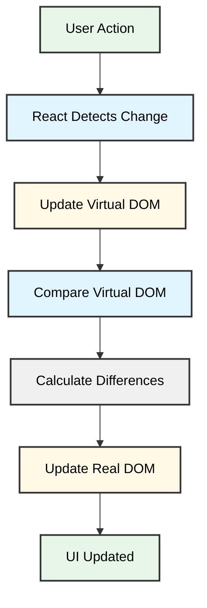


## The History and Evolution of React

React's story begins in 2011 when Jordan Walke, a software engineer at Facebook, created FaxJS—an early prototype that would eventually become React. Frustrated with the limitations of existing frameworks, Walke developed a library that could efficiently update user interfaces without reloading entire pages. His innovation centered on the virtual DOM, a lightweight copy of the actual DOM that allowed React to calculate the most efficient way to update the browser's display by comparing changes before applying them, significantly improving rendering performance.

Facebook began using React internally in 2011 for its News Feed, where the framework proved its ability to handle complex, data-heavy interfaces. In May 2013, the company open-sourced React at JSConf US, making it available to the broader development community. Instagram adopted React shortly after its release, becoming one of the first major platforms outside Facebook to validate its potential and demonstrate its scalability.

The framework's evolution continued with significant milestones that expanded its capabilities. In 2015, Facebook launched React Native, enabling developers to build native mobile applications using React principles. This move solidified React's position as a comprehensive solution for both web and mobile development. In February 2018, React 16.8 introduced Hooks, a feature that revolutionized how developers manage state and side effects in functional components, simplifying code and improving reusability.

By 2024, React stands as one of the most widely adopted JavaScript libraries in the industry. Major companies including Netflix, Airbnb, and X (formerly Twitter) rely on React to power their user interfaces, while a vast ecosystem of tools, libraries, and community resources continues to support its growth and innovation.

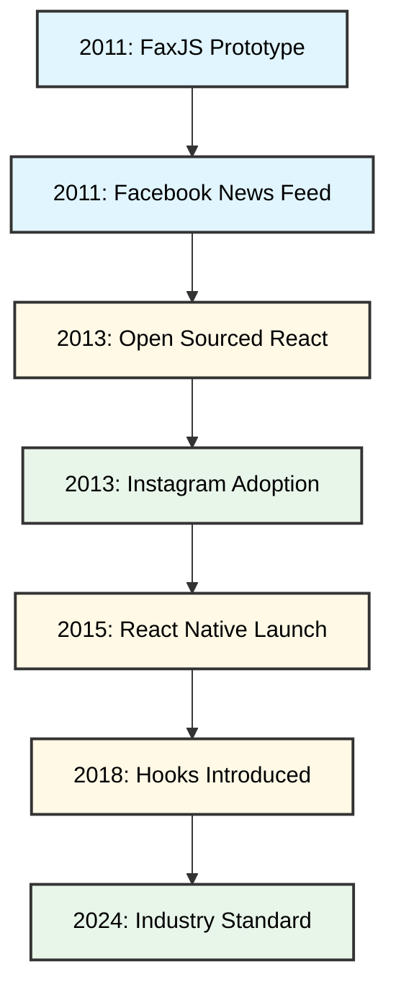


## Core Concepts and Features

Understanding React requires grasping three fundamental innovations that distinguish it from traditional web development approaches: its component model with JSX syntax, the virtual DOM system, and its modular architecture.

## Components and JSX

React structures user interfaces as modular, encapsulated units called components. Each component manages its own logic and rendering, functioning as an independent building block that can be combined with others to create complex interfaces. Components can be reused throughout an application with different properties, eliminating code duplication.

React introduces JSX, an XML-like syntax extension that allows developers to write UI structures directly within JavaScript code. While it resembles HTML, JSX transforms into standard JavaScript function calls during compilation. This approach enables developers to leverage JavaScript's full programming capabilities while maintaining readable markup. For example, JSX allows embedding variables, expressions, and conditional logic directly within the component structure.

## Virtual DOM

The virtual DOM represents React's performance optimization strategy. Rather than manipulating the browser's DOM directly with each change, React maintains a lightweight JavaScript representation of the UI in memory. When application state updates, React creates a new virtual DOM snapshot and employs a diffing algorithm to compare it against the previous version. This reconciliation process identifies precisely which elements changed, allowing React to batch updates and minimize expensive DOM operations. The result is significantly improved rendering performance, particularly in applications with frequent data changes.

## Component Architecture Benefits

React's component-based structure provides several advantages for development teams. Components promote code reusability, as a single component can be deployed multiple times across different contexts with varying props. The modular nature simplifies maintenance and debugging, since issues can be isolated to specific components. Additionally, this architecture supports a unidirectional data flow pattern where data moves predictably from parent to child components, making application state easier to track and manage. This predictable structure scales effectively as applications grow in complexity.

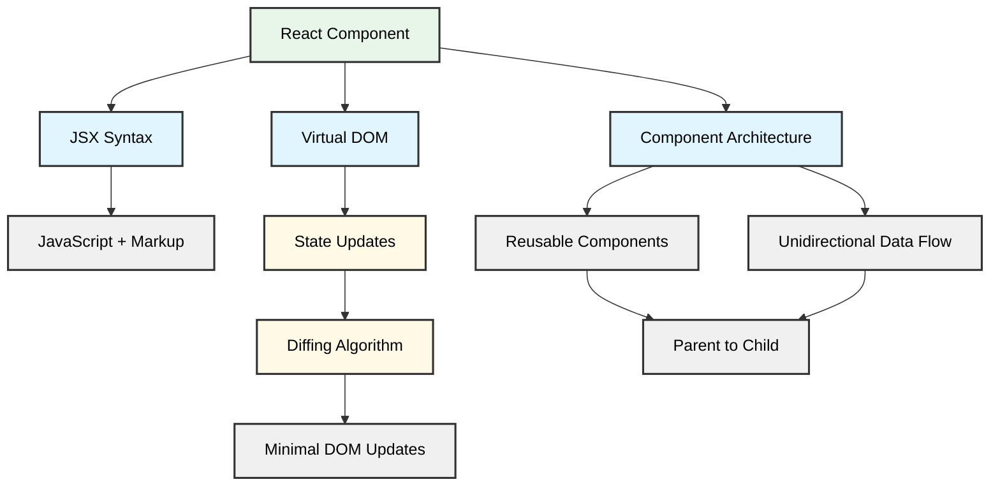


## Understanding React Components

React components are the fundamental building blocks of any React application, serving as reusable, self-contained pieces of UI that encapsulate both structure and behavior. Understanding how components work is essential for building maintainable React applications.

## Types of Components

React offers two primary ways to create components: functional and class components. **Functional components** are JavaScript functions that accept props as arguments and return JSX describing the UI:

```javascript
function Welcome(props) {
  return <h1>Hello, {props.name}</h1>;
}
```

**Class components** extend React.Component and use a render() method:

```javascript
class Welcome extends React.Component {
  render() {
    return <h1>Hello, {this.props.name}</h1>;
  }
}
```

Since the introduction of Hooks in React 16.8, functional components have become the standard approach, as they can now manage state and side effects previously exclusive to class components. However, class components remain relevant in legacy codebases and for implementing error boundaries.

## Component Lifecycle

Components go through distinct lifecycle phases: **mounting** (initial rendering), **updating** (re-rendering when props or state change), and **unmounting** (removal from the DOM). 

In class components, lifecycle methods like `componentDidMount`, `componentDidUpdate`, and `componentWillUnmount` handle these phases. Functional components achieve the same functionality using the `useEffect` Hook:

```javascript
useEffect(() => {
  // Runs after mount and updates
  fetchData();
  
  return () => {
    // Cleanup before unmount
    cancelRequest();
  };
}, [dependencies]);
```

## Building with Components

Components work together through **composition** and **props**. Parent components pass data down to children via props, establishing a unidirectional data flow that makes applications predictable and easier to debug. A Button component might receive styling and click handlers as props, while a Form component orchestrates multiple input components to collect user data. This modular approach promotes code reuse and separation of concerns, allowing developers to build complex interfaces from simple, testable pieces.

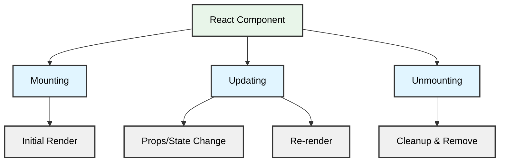


## State Management in React

State management is the foundation of building interactive React applications. It determines how data flows through your components and updates the user interface. Understanding state management options helps you choose the right approach for your application's complexity.

## The useState Hook

The `useState` hook is React's fundamental tool for managing component state. It returns an array with the current state value and a function to update it:

```javascript
const [count, setCount] = useState(0);
```

When you call `setCount`, React schedules a re-render of that component and its children. State updates are asynchronous, so for updates based on previous values, use the functional form: `setCount(prev => prev + 1)`.

## Lifting State Up

When multiple components need to share data, you lift state to their closest common parent. For example, if two sibling components need to share filter criteria, move that state to their parent and pass it down as props. This approach works well for simple hierarchies but can lead to prop drilling—passing props through multiple intermediate components that don't use them.

## Advanced State Management Solutions

For complex state logic within a component, React provides the `useReducer` hook. It works like `useState` but manages state through a reducer function, similar to Redux patterns.

### Context API

React's Context API solves prop drilling by making state accessible to any component in the tree without explicit prop passing. It's built into React and works well for theme data, user authentication, or other global state. However, be aware that context updates cause all consuming components to re-render, which may impact performance in large applications.

### Redux

Redux offers a centralized store with predictable state updates through actions and reducers. It provides excellent debugging tools and middleware support for handling side effects. Redux is beneficial for large applications with complex state interactions, though it requires more boilerplate code.

The React ecosystem continues evolving with lightweight alternatives like Zustand and Jotai. Choose your state management approach based on application size, team familiarity, and specific requirements rather than defaulting to the most popular solution.

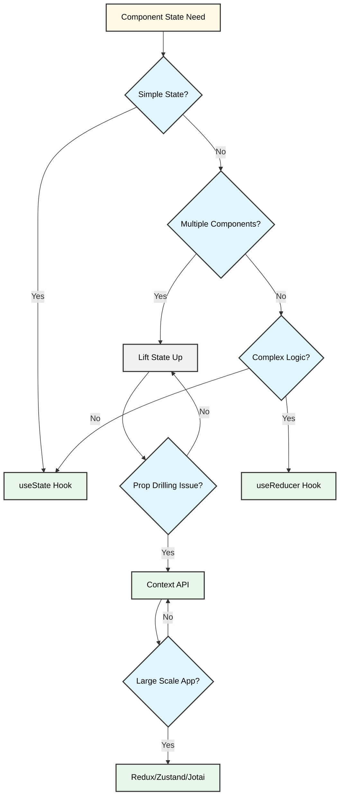


## React Hooks: Modern React Development

React Hooks fundamentally changed how developers write React applications when they were introduced in version 16.8, enabling the use of state and other React features in functional components without requiring class-based components. This shift has led to more concise code with improved readability and reusability.

## What Are React Hooks?

Hooks are JavaScript functions whose names start with "use" by convention. They allow developers to "hook into" React's state and lifecycle features from functional components. When using Hooks, developers must follow two essential rules: only call Hooks at the top level of components (never inside loops, conditions, or nested functions), and only call Hooks from React functional components or custom Hooks.

## Essential Built-in Hooks

**useState** manages component state in functional components. It returns an array containing the current state value and a function to update it:

```javascript
const [count, setCount] = useState(0);
```

This replaces the need for `this.state` and `this.setState()` from class components.

**useEffect** handles side effects such as data fetching, subscriptions, or DOM manipulation. It runs after the browser has painted, following every render by default. Developers can control when effects run using dependency arrays—an empty array means the effect runs only once after the initial render, while including specific values triggers the effect only when those values change.

```javascript
useEffect(() => {
  document.title = `Count: ${count}`;
}, [count]); // Only re-runs when count changes
```

**useContext** provides access to React Context values without prop drilling. It accepts a context object and returns the current context value, making it easier to share data across component trees without manually passing props through every level.

Other commonly used Hooks include useReducer for complex state logic, useMemo for expensive computations, and useCallback for optimizing child component renders.

## Custom Hooks

Custom Hooks enable developers to extract component logic into reusable functions. They can maintain their own state and lifecycle while encapsulating common patterns:

```javascript
function useWindowWidth() {
  const [width, setWidth] = useState(window.innerWidth);
  
  useEffect(() => {
    const handleResize = () => setWidth(window.innerWidth);
    window.addEventListener('resize', handleResize);
    return () => window.removeEventListener('resize', handleResize);
  }, []);
  
  return width;
}
```

This approach promotes code reuse and separation of concerns, delivering on the promise of cleaner and more maintainable applications. While Hooks represent the modern approach, class components remain valid for existing codebases and specific use cases.

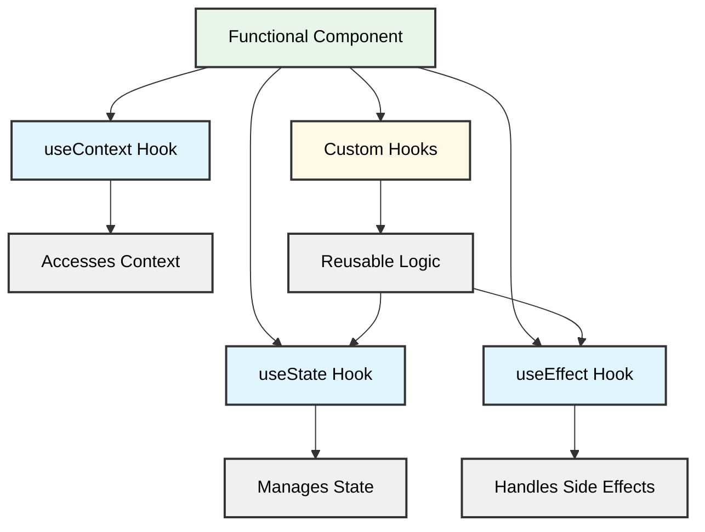


## Benefits and Advantages of Using React

React has established itself as a leading choice for web development through several distinct advantages that address common development challenges.

**Component Reusability and Maintainability**

React's component-based architecture allows developers to build encapsulated UI elements that can be reused throughout an application. This modular approach reduces code duplication and simplifies maintenance, as updates to a component automatically propagate wherever it's used. Development teams can create component libraries that standardize design patterns across projects, accelerating development timelines and ensuring consistency.

**Performance Optimization**

React employs multiple optimization techniques to deliver fast, responsive user interfaces. The virtual DOM efficiently updates only the parts of the page that have changed, rather than re-rendering entire sections. Modern versions of React include concurrent rendering and automatic batching, which further enhance performance by prioritizing user interactions and grouping state updates. These optimizations happen automatically, requiring minimal configuration from developers.

**Robust Ecosystem and Community Support**

Backed by Meta and maintained as an open-source project, React benefits from continuous improvements and extensive community contributions. The ecosystem includes thousands of third-party libraries that extend React's capabilities, such as React Router for navigation, Redux for state management, and Material-UI for pre-built components. This extensive tooling ecosystem means developers rarely need to build complex functionality from scratch.

**Developer Experience**

React provides a streamlined development workflow with features like JSX syntax that combines JavaScript and HTML, React DevTools for debugging, and hot reloading that updates applications instantly during development. The framework's declarative nature makes code more predictable and easier to debug, while comprehensive documentation and abundant learning resources support developers at all skill levels.

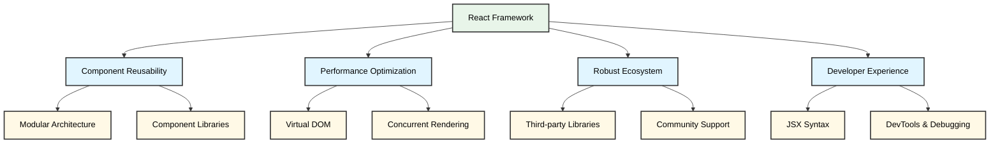


## React Ecosystem and Popular Tools

React's ecosystem extends beyond its core library with tools and frameworks that streamline development workflows. Understanding these components helps developers build applications more efficiently.

**Create React App**, though now in maintenance mode with Vite and other modern alternatives gaining preference, traditionally served as the standard starting point for new projects, offering pre-configured build setups without complex configuration. For production applications requiring server-side rendering, **Next.js** has emerged as the leading framework, providing built-in routing, automatic code splitting, and optimized performance features. **Remix** has also gained traction as a significant alternative in the SSR space.

**React Router** remains the standard solution for client-side navigation, enabling developers to create single-page applications with multiple views and dynamic URL handling.

Testing capabilities are essential for maintaining code quality. **React Testing Library** has become the preferred choice, shifting away from implementation-focused approaches to emphasize testing components as users would interact with them. **Jest** typically serves as the underlying test runner.

State management extends beyond React's built-in options through libraries like **Redux** and **Zustand**, which handle complex application state. Styling solutions such as **styled-components** and **Emotion** enable component-scoped CSS-in-JS approaches. For server state and data fetching, **React Query** (TanStack Query) simplifies asynchronous data management and caching strategies. These tools collectively form a comprehensive development environment tailored to various project requirements.

```mermaid
flowchart TD
    A[React Core Library] --> B[Build Tools]
    A --> C[Routing]
    A --> D[Testing]
    A --> E[State Management]
    A --> F[Styling Solutions]
    A --> G[Data Fetching]
    
    B --> B1[Vite]
    B --> B2[Create React App]
    
    C --> C1[React Router]
    
    D --> D1[React Testing Library]
    D --> D2[Jest]
    
    E --> E1[Redux]
    E --> E2[Zustand]
    
    F --> F1[styled-components]
    F --> F2[Emotion]
    
    G --> G1[React Query]
    
    A --> H[SSR Frameworks]
    H --> H1[Next.js]
    H --> H2[Remix]
    
    style A fill:#e8f5e9,stroke:#333,stroke-width:2px,color:#000
    style B fill:#e1f5ff,stroke:#333,stroke-width:2px,color:#000
    style C fill:#e1f5ff,stroke:#333,stroke-width:2px,color:#000
    style D fill:#e1f5ff,stroke:#333,stroke-width:2px,color:#000
    style E fill:#e1f5ff,stroke:#333,stroke-width:2px,color:#000
    style F fill:#e1f5ff,stroke:#333,stroke-width:2px,color:#000
    style G fill:#e1f5ff,stroke:#333,stroke-width:2px,color:#000
    style H fill:#e1f5ff,stroke:#333,stroke-width:2px,color:#000
    style B1 fill:#fff9e6,stroke:#333,stroke-width:2px,color:#000
    style B2 fill:#fff9e6,stroke:#333,stroke-width:2px,color:#000
    style C1 fill:#fff9e6,stroke:#333,stroke-width:2px,color:#000
    style D1 fill:#fff9e6,stroke:#333,stroke-width:2px,color:#000
    style D2 fill:#fff9e6,stroke:#333,stroke-width:2px,color:#000
    style E1 fill:#fff9e6,stroke:#333,stroke-width:2px,color:#000
    style E2 fill:#fff9e6,stroke:#333,stroke-width:2px,color:#000
    style F1 fill:#fff9e6,stroke:#333,stroke-width:2px,color:#000
    style F2 fill:#fff9e6,stroke:#333,stroke-width:2px,color:#000
    style G1 fill:#fff9e6,stroke:#333,stroke-width:2px,color:#000
    style H1 fill:#fff9e6,stroke:#333,stroke-width:2px,color:#000
    style H2 fill:#fff9e6,stroke:#333,stroke-width:2px,color:#000
```


## Getting Started with React

## Prerequisites

Before diving into React, you should have a solid understanding of HTML, CSS, and JavaScript fundamentals. Familiarity with ES6+ features like arrow functions, destructuring, and modules will make your learning experience smoother. You'll also need Node.js installed on your computer to use modern React development tools.

## Setting Up Your Environment

The quickest way to start is with Create React App, which sets up a complete development environment with zero configuration, letting you focus on learning, not configuration. Open your terminal and run:

```bash
npx create-react-app my-first-app
cd my-first-app
npm start
```

This launches your new React app in the browser at localhost:3000. Alternatively, consider Vite as a modern, faster alternative to Create React App for new projects.

## Learning Resources

Start with the official React documentation, which provides comprehensive tutorials and guides. For structured courses, platforms like freeCodeCamp, Codecademy, and Scrimba offer interactive lessons. YouTube channels such as Traversy Media and The Net Ninja provide quality video tutorials for visual learners.

## Practice Projects

Build simple projects to reinforce concepts. Start with a todo list app (teaches state management and event handling), then progress to a weather app (covers API integration) and a recipe finder (combines multiple concepts). Join communities like the Reactiflux Discord or Reddit's r/reactjs to connect with other learners and get help when stuck.

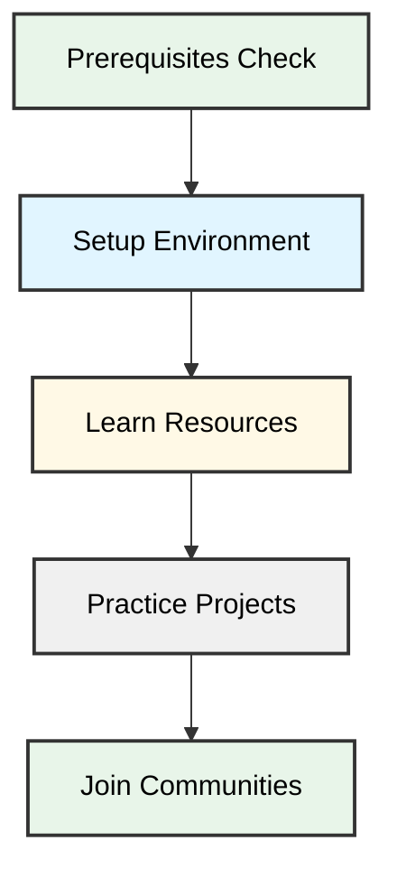


## Real-World Applications and Use Cases

React's widespread adoption by major companies and startups demonstrates its reliability and scalability in production environments. Organizations across various industries have leveraged React to build robust, high-performance applications.

## Social Media and Communication

Facebook, React's creator, uses it extensively across its platform and Instagram, handling billions of user interactions daily. WhatsApp Web also relies on React to deliver its messaging interface, demonstrating the library's capability to manage real-time communication at scale.

## Entertainment and Media

Netflix employs React for its user interface, enabling seamless content browsing and playback across devices. The platform benefits from React's component reusability and performance optimizations to deliver a consistent viewing experience. Airbnb has similarly built its booking platform using React, managing complex search functionality and reservation workflows.

## Business and Productivity

Dropbox rebuilt its web interface with React to improve performance and user experience. Microsoft uses React in several products, including Office 365 and Teams, showcasing the library's enterprise-grade capabilities. Atlassian's collaboration tools, such as Jira and Trello, leverage React for their interactive project management interfaces.

## E-commerce and Retail

Shopify powers thousands of online stores with React-based storefronts, enabling merchants to create customizable shopping experiences. Walmart has adopted React for its e-commerce platform, handling high-traffic shopping events and complex inventory systems.

## Emerging Applications

Beyond traditional web applications, React Native extends React's principles to mobile development, with companies like Discord and Bloomberg using it for cross-platform mobile apps. This versatility demonstrates React's adaptability to evolving technology landscapes and diverse application requirements.

```mermaid
flowchart TD
    A[React Library] --> B[Social Media]
    A --> C[Entertainment & Media]
    A --> D[Business & Productivity]
    A --> E[E-commerce & Retail]
    A --> F[Mobile Apps]
    
    B --> B1[Facebook]
    B --> B2[Instagram]
    B --> B3[WhatsApp Web]
    
    C --> C1[Netflix]
    C --> C2[Airbnb]
    
    D --> D1[Dropbox]
    D --> D2[Microsoft Office 365]
    D --> D3[Atlassian Tools]
    
    E --> E1[Shopify]
    E --> E2[Walmart]
    
    F --> F1[Discord]
    F --> F2[Bloomberg]
    
    style A fill:#e8f5e9,stroke:#333,stroke-width:2px,color:#000
    style B fill:#e1f5ff,stroke:#333,stroke-width:2px,color:#000
    style C fill:#e1f5ff,stroke:#333,stroke-width:2px,color:#000
    style D fill:#e1f5ff,stroke:#333,stroke-width:2px,color:#000
    style E fill:#e1f5ff,stroke:#333,stroke-width:2px,color:#000
    style F fill:#e1f5ff,stroke:#333,stroke-width:2px,color:#000
    style B1 fill:#f0f0f0,stroke:#333,stroke-width:2px,color:#000
    style B2 fill:#f0f0f0,stroke:#333,stroke-width:2px,color:#000
    style B3 fill:#f0f0f0,stroke:#333,stroke-width:2px,color:#000
    style C1 fill:#f0f0f0,stroke:#333,stroke-width:2px,color:#000
    style C2 fill:#f0f0f0,stroke:#333,stroke-width:2px,color:#000
    style D1 fill:#f0f0f0,stroke:#333,stroke-width:2px,color:#000
    style D2 fill:#f0f0f0,stroke:#333,stroke-width:2px,color:#000
    style D3 fill:#f0f0f0,stroke:#333,stroke-width:2px,color:#000
    style E1 fill:#f0f0f0,stroke:#333,stroke-width:2px,color:#000
    style E2 fill:#f0f0f0,stroke:#333,stroke-width:2px,color:#000
    style F1 fill:#f0f0f0,stroke:#333,stroke-width:2px,color:#000
    style F2 fill:#f0f0f0,stroke:#333,stroke-width:2px,color:#000
```


## Conclusion: The Future of React

React remains a dominant force in web development, continuing to evolve with innovations like Server Components and concurrent rendering that push the boundaries of performance and user experience. Meta's sustained investment, combined with a mature ecosystem of tools including Next.js, testing libraries, and thousands of community-built packages, ensures the framework stays relevant for modern development needs.

The job market reflects this stability, with React skills consistently ranking among the most sought-after qualifications for frontend developers. Its component-based architecture and declarative approach have influenced the broader development landscape, establishing patterns that extend beyond the framework itself.

For developers considering where to invest their learning efforts, React offers both immediate practical value and long-term career benefits. While new frameworks emerge regularly, React's proven track record, extensive documentation, and active community make it a reliable foundation for building scalable web applications. Whether you're starting your development journey or expanding your skill set, React continues to be a worthwhile investment that opens doors across the industry.

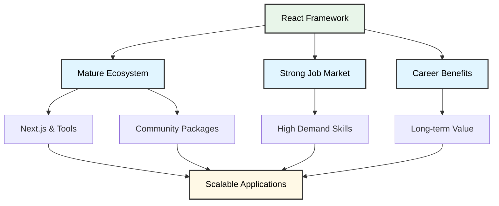


