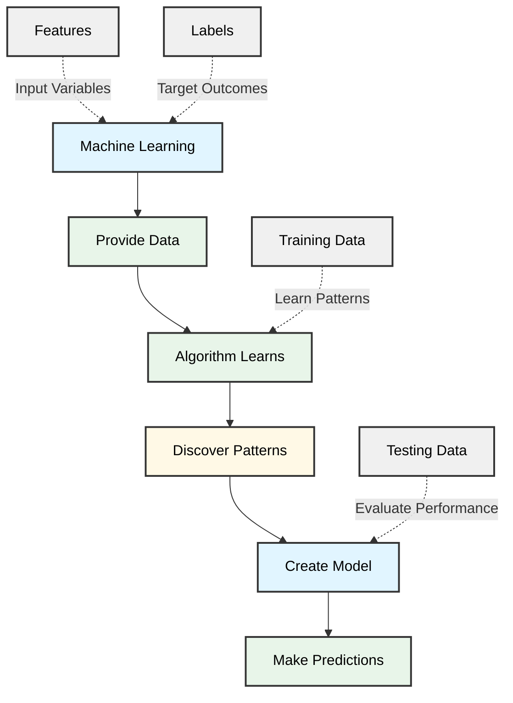
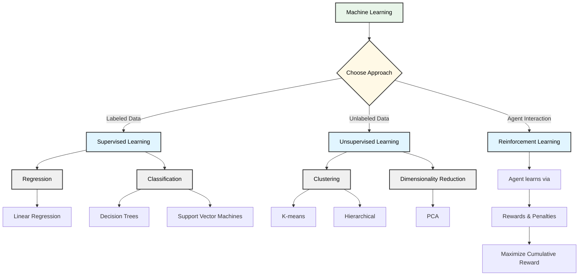
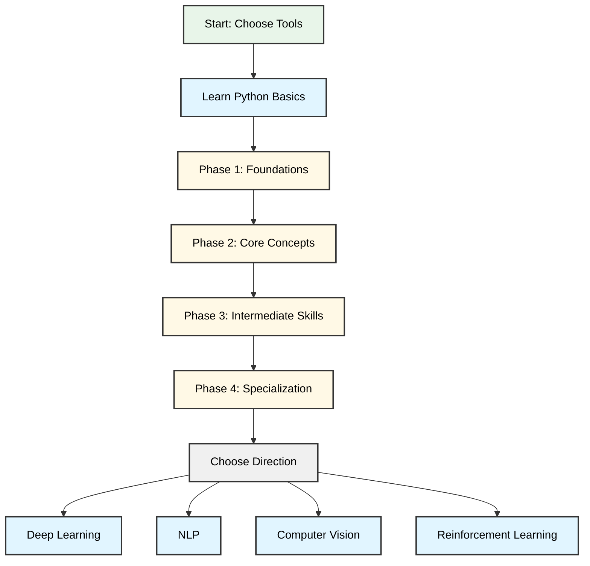

# machine learing

## Introduction to Machine Learning: Foundations and Core Concepts

# Introduction to Machine Learning: Foundations and Core Concepts

Machine learning is a subset of artificial intelligence that enables computers to learn from data and make predictions or decisions without being explicitly programmed for every scenario [web_3]. Rather than following a rigid set of instructions, machine learning systems identify patterns in data and improve their performance through experience.

## Traditional Programming vs. Machine Learning

The distinction between traditional programming and machine learning is fundamental to understanding this field. In traditional programming, developers write explicit rules that computers follow to produce outputs. A programmer might write: "If temperature > 80°F, turn on the air conditioner." Machine learning inverts this approach. Instead of writing rules, you provide data and let the algorithm discover the patterns and rules itself. The system learns what conditions warrant turning on the air conditioner by analyzing historical data about temperature, humidity, and user preferences.

## Core Concepts You Need to Know

Before diving deeper, familiarize yourself with these five foundational concepts:

**Features** are the input variables your model uses to make predictions. For example, in predicting house prices, features might include square footage, location, and age. The quality and relevance of your features directly impact model performance.

**Labels** (or targets) represent the correct answers or outcomes you want your model to predict. In the house price example, the label is the actual selling price.

**Training and Testing** refers to how you evaluate your model. During training, the algorithm learns patterns from a dataset. During testing, you assess how well it performs on new, unseen data. This separation prevents your model from simply memorizing answers.

**Algorithms** are the mathematical procedures that find patterns in data. Different algorithms suit different problems—some excel at classification (categorizing data), while others handle regression (predicting continuous values).

**Model** is the final product: a mathematical representation of the patterns learned from your training data. Think of it as a trained expert ready to make predictions on new inputs.

## Why This Matters

Understanding these foundations prepares you for more advanced topics like supervised learning, unsupervised learning, and neural networks. Each builds on these core ideas. As you progress, you'll encounter variations and complexities, but they all rest on these fundamental principles [web_1].

The journey into machine learning requires grasping how computers learn from examples rather than following predetermined rules. With these concepts as your foundation, you're ready to explore specific algorithms and techniques that power modern AI applications.

## Machine Learning Algorithms and Types: Supervised, Unsupervised, and Reinforcement Learning

# Machine Learning Algorithms and Types: Supervised, Unsupervised, and Reinforcement Learning

Machine learning enables systems to learn from data without explicit programming, making it possible to solve complex problems across diverse domains. Understanding the different types of machine learning is essential for selecting the right approach for your specific problem. The three main categories—supervised, unsupervised, and reinforcement learning—each serve distinct purposes and work with different types of data [web_2].

## Supervised Learning

Supervised learning is the most commonly used machine learning approach. It works with labeled data, meaning each training example includes both input features and the correct output or target value. The algorithm learns to predict outcomes for new data based on input-output relationships [web_2].

Supervised learning divides into two primary tasks: regression and classification.

**Regression** predicts continuous numerical values. Linear regression fits a straight line through data points to model relationships between inputs and continuous targets while minimizing prediction errors. For example, predicting house prices based on features like square footage, location, and age involves regression. The algorithm identifies patterns in historical data and applies them to estimate prices for new properties.

**Classification** predicts discrete categories or classes. Decision trees work by splitting data into branches based on feature values, creating a tree-like structure that leads to class predictions. For instance, an email system might use classification to determine whether a message is spam or legitimate based on sender information, subject line, and content patterns. Support Vector Machines (SVMs) find optimal boundaries between different classes, making them effective for binary and multi-class problems [web_2].

Supervised learning excels when you have sufficient labeled data and a clear understanding of what you want to predict. However, obtaining labeled data can be expensive and time-consuming, which sometimes limits its application.

## Unsupervised Learning

Unsupervised learning works with unlabeled data, where no target values are provided. This approach is valuable when you have data but lack predefined categories or target values. Instead, algorithms discover hidden patterns, structures, and relationships within the data [web_2].

**Clustering** is the primary unsupervised learning task. It groups similar data points together without predefined labels.

K-means clustering divides data into K clusters by iteratively assigning points to the nearest cluster center and updating centers based on cluster members. Imagine an e-commerce company analyzing customer purchase behavior without predefined customer segments. K-means could automatically identify distinct customer groups based on spending patterns, frequency, and product preferences.

Hierarchical clustering builds a tree-like structure showing relationships between data points at different levels of similarity. This approach is useful for understanding hierarchical relationships in data and works well when you want to explore data at multiple levels of granularity.

**Dimensionality reduction** simplifies data by reducing the number of features while preserving important information. Principal Component Analysis (PCA) transforms high-dimensional data into fewer dimensions, making it easier to visualize and process. This is particularly useful when dealing with datasets containing hundreds or thousands of features.

Unsupervised learning is ideal for exploratory data analysis and discovering unexpected patterns. However, results can be harder to evaluate since there are no ground truth labels to compare against.

## Reinforcement Learning

Reinforcement learning differs fundamentally from the previous two approaches. Instead of learning from static datasets, an agent learns by interacting with an environment, receiving feedback in the form of rewards or penalties for its actions. The goal is to develop a strategy that maximizes cumulative rewards over time [web_2].

Key components of reinforcement learning include:

- **Agent**: The learner that takes actions
- **Environment**: The system the agent interacts with
- **State**: The current situation or configuration
- **Action**: Choices the agent can make
- **Reward**: Feedback indicating action quality

A classic example is training a computer to play chess or Go. The agent explores different moves, receives rewards for winning positions and penalties for losing moves, and gradually develops strategies that lead to victory. DeepMind's AlphaGo system famously used reinforcement learning to defeat world champion Go players by learning optimal strategies through millions of game simulations.

Reinforcement learning also applies to robotics, autonomous vehicles, and game AI. A robot learning to navigate a maze receives positive rewards for moving toward the exit and negative rewards for hitting walls. Over time, it discovers the optimal path.

The main challenge with reinforcement learning is that it often requires extensive interaction with the environment, which can be time-consuming and expensive. Additionally, defining appropriate reward systems is critical—poorly designed rewards can lead to unintended behaviors.

## Choosing the Right Approach

Selecting between these three approaches depends on your problem characteristics and available data:

Choose **supervised learning** when you have labeled data and want to make specific predictions. Use it for tasks like predicting values, classifying items, or making decisions based on historical patterns.

Choose **unsupervised learning** when you have unlabeled data and want to discover patterns or structure. Use it for customer segmentation, anomaly detection, or exploratory analysis.

Choose **reinforcement learning** when you need an agent to learn through interaction and feedback. Use it for sequential decision-making, game playing, or control systems.

Many real-world applications combine multiple approaches. A recommendation system might use unsupervised learning to cluster users, supervised learning to predict ratings, and reinforcement learning to optimize recommendations based on user feedback.

Understanding these three fundamental approaches forms the foundation for selecting appropriate algorithms for your specific challenges. As you progress in machine learning, you'll find that most advanced techniques build upon these core concepts, combining them in sophisticated ways to solve complex problems.

## Real-World Applications and Use Cases of Machine Learning

# Real-World Applications and Use Cases of Machine Learning

Machine learning has moved far beyond research laboratories and theoretical discussions. Today, it powers practical solutions across industries, solving tangible problems that affect millions of people daily. Understanding these applications helps bridge the gap between the concepts you learn in theory and the real-world impact they create.

## Healthcare and Medical Diagnosis

In healthcare, machine learning is transforming how diseases are detected and treated. Diagnostic systems now analyze medical imaging—X-rays, MRIs, and CT scans—to identify anomalies like tumors, fractures, and lesions often with accuracy matching or exceeding human radiologists [web_4]. These systems process vast amounts of patient data to flag potential health risks early, when intervention is most effective.

Beyond imaging, machine learning models predict patient outcomes and recommend personalized treatment plans based on genetic data, medical history, and clinical research. Hospitals use predictive analytics to identify patients at high risk of readmission or complications, enabling proactive care interventions. This application directly improves survival rates and reduces healthcare costs.

## Natural Language Processing in Customer Service

Natural language processing, a specialized branch of machine learning, powers the chatbots and virtual assistants you interact with daily [web_6]. These systems understand customer inquiries, extract relevant information, and provide appropriate responses—often without human intervention. Banks use NLP to process loan applications, insurance companies deploy it to handle claims, and retailers use it to answer product questions.

Sentiment analysis, another NLP application, helps companies monitor social media and customer feedback in real-time. Businesses identify dissatisfied customers immediately, enabling rapid response to concerns before they escalate. This automated monitoring would be impossible through manual review alone.

## E-Commerce and Personalization

When you receive product recommendations on shopping platforms, machine learning operates behind the scenes. Recommendation engines analyze your browsing history, purchase behavior, and preferences alongside patterns from millions of other users to suggest items you're likely to buy [web_6]. This personalization increases sales for retailers while improving the shopping experience for customers.

Dynamic pricing represents another e-commerce application where machine learning adjusts prices based on demand, competition, inventory levels, and customer segments. This optimization maximizes revenue while maintaining competitive positioning in real-time markets.

## Transportation and Autonomous Systems

Machine learning is fundamental to the development of autonomous vehicles and driver-assistance features like lane-keeping and collision avoidance. These systems process data from cameras, radar, and sensors to make real-time decisions about acceleration, braking, and steering. The complexity of this application—requiring the model to handle unpredictable environments and make safety-critical decisions—demonstrates machine learning's capability to manage high-stakes scenarios.

Ride-sharing platforms use machine learning to optimize driver routing, predict demand patterns, and match passengers with drivers efficiently. Delivery companies employ similar systems to plan optimal routes for thousands of vehicles daily, reducing fuel costs and delivery times.

## Manufacturing and Predictive Maintenance

In manufacturing, machine learning predicts equipment failures before they occur. By analyzing sensor data from machinery—vibration patterns, temperature, acoustic signals—models identify degradation trends and alert maintenance teams to schedule repairs proactively. This predictive maintenance reduces unplanned downtime, extends equipment lifespan, and cuts maintenance costs significantly compared to reactive repair approaches.

Quality control represents another manufacturing application where computer vision systems powered by machine learning inspect products at production speeds, detecting defects humans might miss. This automation ensures consistent product quality while reducing labor costs.

## Finance and Fraud Detection

Financial institutions deploy machine learning to detect fraudulent transactions in real-time. These systems analyze transaction patterns, location data, spending habits, and historical information to flag suspicious activity instantly. Unlike rule-based systems that can be circumvented, machine learning models adapt as fraud tactics evolve, continuously learning from new patterns.

Credit scoring and loan approval processes now incorporate machine learning to assess risk more accurately than traditional methods. These models consider thousands of variables to make lending decisions faster and more fairly.

## Social Impact and Public Health

Machine learning contributes to broader societal challenges. Epidemiologists use predictive models to forecast disease spread and optimize vaccination strategies. Environmental scientists employ machine learning to monitor deforestation, track wildlife populations, and predict natural disasters like floods and earthquakes.

In education, adaptive learning platforms use machine learning to personalize content delivery, identifying where individual students struggle and adjusting difficulty accordingly. This customization improves learning outcomes, particularly for students who need additional support.

## Conclusion

These applications demonstrate that machine learning isn't a distant technology—it's actively solving real problems affecting society today. From detecting cancers earlier to preventing equipment failures, machine learning translates theoretical concepts into practical systems that create measurable value. As you progress in your studies, recognizing these real-world connections will deepen your understanding of why specific algorithms and techniques matter. The skills you develop now have direct applications in industries actively seeking professionals who can bridge theory and practice.

```mermaid
flowchart TD
    A[Machine Learning<br/>Applications] --> B[Healthcare &<br/>Medical Diagnosis]
    A --> C[Natural Language<br/>Processing]
    A --> D[E-Commerce &<br/>Personalization]
    A --> E[Transportation &<br/>Autonomous Systems]
    A --> F[Manufacturing &<br/>Predictive Maintenance]
    A --> G[Finance &<br/>Fraud Detection]
    A --> H[Social Impact &<br/>Public Health]
    
    B --> B1[Medical Imaging<br/>Analysis]
    B --> B2[Patient Outcome<br/>Prediction]
    
    C --> C1[Customer Service<br/>Chatbots]
    C --> C2[Sentiment<br/>Analysis]
    
    D --> D1[Recommendation<br/>Engines]
    D --> D2[Dynamic<br/>Pricing]
    
    E --> E1[Autonomous<br/>Vehicles]
    E --> E2[Route<br/>Optimization]
    
    F --> F1[Predictive<br/>Maintenance]
    F --> F2[Quality<br/>Control]
    
    G --> G1[Fraud<br/>Detection]
    G --> G2[Credit<br/>Scoring]
    
    H --> H1[Disease<br/>Forecasting]
    H --> H2[Adaptive<br/>Learning]
    
    style A fill:#e8f5e9,stroke:#333,stroke-width:2px,color:#000
    style B fill:#e1f5ff,stroke:#333,stroke-width:2px,color:#000
    style C fill:#e1f5ff,stroke:#333,stroke-width:2px,color:#000
    style D fill:#e1f5ff,stroke:#333,stroke-width:2px,color:#000
    style E fill:#e1f5ff,stroke:#333,stroke-width:2px,color:#000
    style F fill:#e1f5ff,stroke:#333,stroke-width:2px,color:#000
    style G fill:#e1f5ff,stroke:#333,stroke-width:2px,color:#000
    style H fill:#e1f5ff,stroke:#333,stroke-width:2px,color:#000
    style B1 fill:#fff9e6,stroke:#333,stroke-width:2px,color:#000
    style B2 fill:#fff9e6,stroke:#333,stroke-width:2px,color:#000
    style C1 fill:#fff9e6,stroke:#333,stroke-width:2px,color:#000
    style C2 fill:#fff9e6,stroke:#333,stroke-width:2px,color:#000
    style D1 fill:#fff9e6,stroke:#333,stroke-width:2px,color:#000
    style D2 fill:#fff9e6,stroke:#333,stroke-width:2px,color:#000
    style E1 fill:#fff9e6,stroke:#333,stroke-width:2px,color:#000
    style E2 fill:#fff9e6,stroke:#333,stroke-width:2px,color:#000
    style F1 fill:#fff9e6,stroke:#333,stroke-width:2px,color:#000
    style F2 fill:#fff9e6,stroke:#333,stroke-width:2px,color:#000
    style G1 fill:#fff9e6,stroke:#333,stroke-width:2px,color:#000
    style G2 fill:#fff9e6,stroke:#333,stroke-width:2px,color:#000
    style H1 fill:#fff9e6,stroke:#333,stroke-width:2px,color:#000
    style H2 fill:#fff9e6,stroke:#333,stroke-width:2px,color:#000
```

## Getting Started: Tools, Languages, and Your Learning Path

# Getting Started: Tools, Languages, and Your Learning Path

Choosing the right tools and languages upfront prevents costly missteps later. A strategic foundation accelerates progress and builds the confidence needed to tackle advanced topics.

## Essential Programming Languages

**Python** dominates machine learning for good reason. Its intuitive syntax, extensive libraries (NumPy, Pandas, Scikit-learn), and strong community support make it the industry standard [web_2]. Most beginners should start here—you'll find abundant tutorials, datasets, and job opportunities aligned with Python expertise.

**R** excels for statistical analysis and data visualization [web_2]—many practitioners use both languages depending on project needs. If your focus leans toward statistical modeling, R is worth exploring after mastering Python fundamentals.

**SQL** deserves mention as a non-negotiable skill. Real-world machine learning involves data retrieval and manipulation, making SQL proficiency essential for any practitioner.

## Core Tools to Master

Start with **Jupyter Notebooks** for interactive learning and experimentation. They combine code, visualizations, and documentation in one environment, making them ideal for exploration.

**Scikit-learn** provides user-friendly implementations of classical algorithms and is perfect for beginners. As you progress, explore **TensorFlow** or **PyTorch** for deep learning projects.

Version control using **Git and GitHub** should be learned early. These tools are industry standards for collaboration and portfolio building.

## Your Structured Learning Path

**Phase 1: Foundations (Weeks 1-4)**
Master Python basics and essential libraries. Learn exploratory data analysis (EDA) techniques [web_2] to understand datasets before modeling—practice with datasets like Iris or Titanic. Build comfort with data manipulation and visualization.

**Phase 2: Core Concepts (Weeks 5-8)**
Study fundamental algorithms: linear regression, logistic regression, and decision trees. Understand the mathematics behind these methods [web_2]. Complete end-to-end projects applying each algorithm to real datasets.

**Phase 3: Intermediate Skills (Weeks 9-12)**
Explore ensemble methods, feature engineering, and model evaluation techniques. Learn cross-validation and hyperparameter tuning. Work on Kaggle competitions to benchmark your skills.

**Phase 4: Specialization (Weeks 13+)**
Choose your direction: deep learning, natural language processing, computer vision, or reinforcement learning. Dive deeper into specialized libraries and advanced techniques.

## Key Principles

Don't rush into advanced topics. Skipping fundamentals creates gaps that compound later. Practice consistently with real datasets rather than toy examples. Build projects that solve actual problems—this reinforces learning and creates portfolio pieces.

Tools and languages evolve rapidly, but foundational concepts endure [web_3]. Focus on understanding principles deeply, and you'll adapt to new tools throughout your career.

## References

- [The Ultimate Beginner Guide to Machine Learning - Reddit](https://www.reddit.com/r/learnmachinelearning/comments/1fxqko8/the_ultimate_beginner_guide_to_machine_learning/)
- [Machine Learning Tutorial - GeeksforGeeks](https://www.geeksforgeeks.org/machine-learning/machine-learning/)
- [Start Here with Machine Learning](https://machinelearningmastery.com/start-here/)
- [Machine Learning Examples, Applications & Use Cases | IBM](https://www.ibm.com/think/topics/machine-learning-use-cases)
- [10 Machine Learning Applications  | Coursera](https://www.coursera.org/articles/machine-learning-applications)
