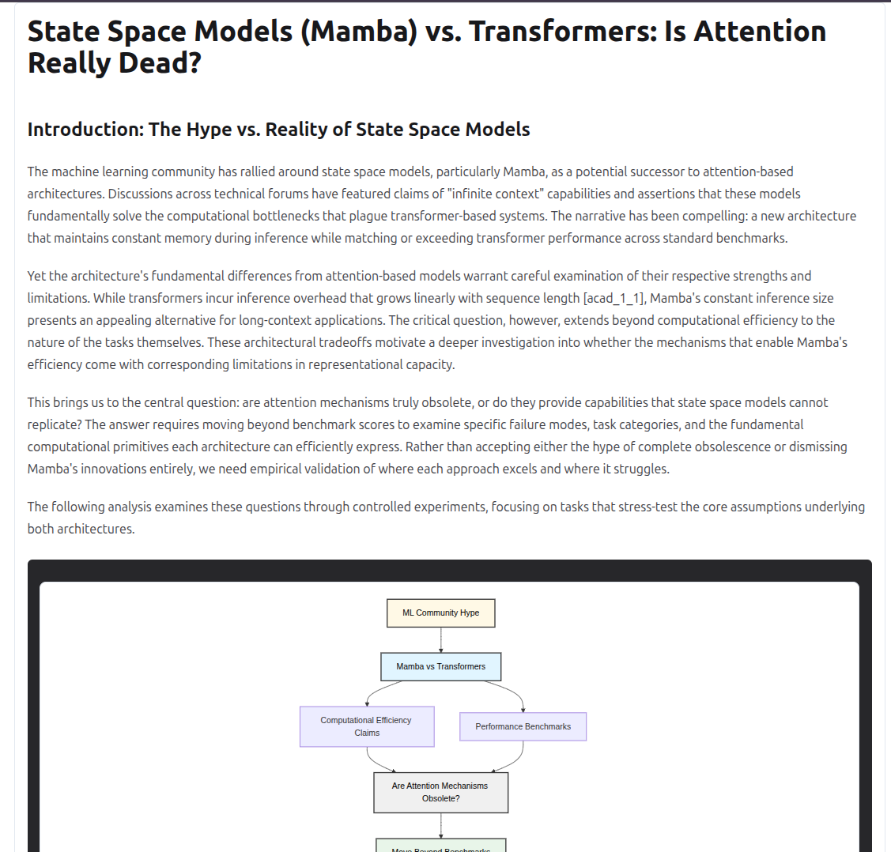
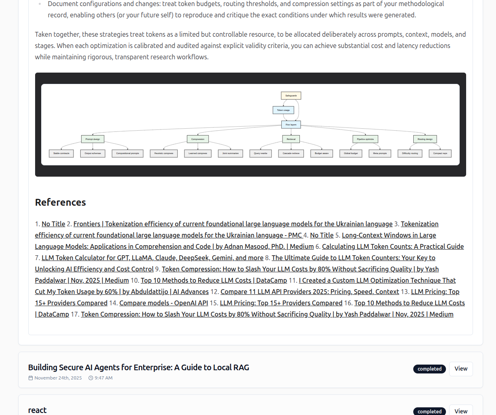

# Content Strategist Agent (Blog-Gen)

An enterprise-grade AI agent that turns your internal documents into authoritative, SEO-optimized articles without your data ever leaving your infrastructure.

---

## 📌 A. Problem Statement

**The Issue:**
Creating quality blogs requires research, competitive analysis, keyword optimization, outlining, and compelling writing—taking hours across multiple tools.

**The "Generic AI" Trap:**
For enterprises and professionals, standard AI writing tools (ChatGPT wrappers) fail in three critical areas:

1. **Hallucination & Fluff:** They produce generic, surface-level content that lacks authority.
2. **Data Amnesia:** They cannot access deep internal knowledge (PDFs, reports, brand guidelines) securely.

**The Result:** Content that sounds like AI, lacks brand voice

---

## 📌 B. Solution Overview

**We aren't building a "Writer." We are building a "Content Strategist."**

Our platform is an end-to-end agentic workflow that mimics a human editorial team. It researches, plans, cites internal data, writes, and self-corrects—all while keeping your data secure.

**Core Value Proposition:**

> "Turn your internal documents into authoritative, SEO-optimized articles without your data ever leaving your infrastructure."

### Key Features:

* **🔍 Deep Research:** Parallels web search (Firecrawl) with internal document search (Pinecone RAG) to ground every claim.
* **🧬 Style DNA:** Analyzes your existing content to extract and mimic your unique brand voice (tone, vocabulary, formatting).
* **👁️ "Glass Box" Observability:** Watch the agent's thought process in real-time via Server-Sent Events (SSE).
* **🔄 Reflexion Loop:** A dedicated "Critic" agent reviews every draft, forcing revisions until quality standards are met.
* **📊 Visuals:** Automatically generates Mermaid.js diagrams for complex concepts.

---

## 📌 C. Architecture Diagram

The agent is orchestrated using **LangGraph**, a stateful graph-based framework.


## 📌 D. Tech Stack

### Backend

* **Framework:** FastAPI (Python 3.11+)
* **Orchestration:** LangGraph, LangChain
* **Database:** PostgreSQL (AsyncPostgresSaver for state, SQLAlchemy for app data)
* **Vector Store:** Pinecone (Serverless)
* **Search:** Firecrawl (Web), Arxiv (Academic)
* **LLMs:** OpenAI (GPT-5.1,GPT-5mini), Anthropic (sonnet4.5,haiku4.5), Google (Gemini 3 pro), Ollama (Qwen 3, Llama 3 or any model supported by ollama)

### Frontend

* **Framework:** React 19 + Vite
* **Styling:** Tailwind CSS, Shadcn UI
* **Visualization:** Mermaid.js, Lucide React
* **State/API:** Axios, EventSource (SSE)

### Infrastructure

* **Containerization:** Docker & Docker Compose
* **Migrations:** Alembic

---

## 📌 E. How to Run the Project

### Prerequisites

* Docker & Docker Compose
* Node.js 18+
* Python 3.11+
* **Ollama** (Optional, for local privacy mode)

### 🚀 Quick Start

We have provided automated scripts to get you up and running quickly.

#### Option 1: Docker Compose (Recommended)

The easiest way to run the entire stack (Frontend + Backend + Database) in isolated containers.

1. **Clone the Repository**

   ```bash
   git clone https://github.com/shasank0001/Blog-Gen.git
   cd Blog-Gen
   ```
2. **Configure API Keys**
   Create `backend/.env` from the example and add your keys:

   ```bash
   cp backend/.env.example backend/.env
   # Edit backend/.env with your API keys
   ```
3. **Run with Docker Compose**

   ```bash
   docker-compose up --build
   ```

   * **Frontend:** http://localhost:5173
   * **API Docs:** http://localhost:8000/docs

#### Option 2: Local Scripts (macOS / Linux / WSL)

1. **Run Setup Script**

   ```bash
   ./setup.sh
   ```
2. **Configure API Keys**
   Open `backend/.env` and add your API keys.
3. **Start the Application**

   ```bash
   ./start.sh
   ```

#### Option 3: Local Scripts (Windows)

1. **Run Setup Script**
   Double-click `setup.bat` or run:

   ```cmd
   setup.bat
   ```
2. **Configure API Keys**
   Open `backend\.env` and add your API keys.
3. **Start the Application**
   Double-click `start.bat` or run:

   ```cmd
   start.bat
   ```

---

### Manual Setup (Alternative)

If you prefer to configure things manually:

1. **Configure Environment Variables**
   Create a `.env` file in the `backend/` directory:

   ```bash
   cp backend/.env.example backend/.env
   # Edit backend/.env with your API keys (see Section F)
   ```

   At a minimum set `DATABASE_URL`, `OPENAI_API_KEY`, `FIRECRAWL_API_KEY`, `PINECONE_API_KEY`, and a unique `SECRET_KEY`. Optional knobs such as `USE_LOCAL_LLM`/`USE_LOCAL_EMBEDDINGS` can stay at their defaults until you need them.
2. **Start Database (Docker)**

   ```bash
   cd backend
   docker-compose up -d
   ```

   * This starts the PostgreSQL database container.
   * Leave it running in the background while you develop.
3. **Apply Database Migrations**

   ```bash
   cd backend
   alembic upgrade head
   ```

   * Run this once after the database container is up (and again whenever models change) to create every table/enum.
4. **Start Backend Server**

   In the same `backend` directory:

   ```bash
   # Install dependencies if not already done
   python3 -m venv venv
   source venv/bin/activate
   pip install -r requirements.txt

   # Run the server
   uvicorn app.main:app --reload
   ```
5. **Start Frontend**
   Open a new terminal:

   ```bash
   cd frontend
   npm install
   npm run dev
   ```
6. **Access the Application**

   * **Frontend:** http://localhost:5173
   * **API Docs:** http://localhost:8000/docs

### Local Privacy Mode (Ollama) Setup

To run the agent without sending data to OpenAI:

1. Install [Ollama](https://ollama.com/).
2. Pull the required models:
   ```bash
   ollama pull qwen2.5
   ollama pull nomic-embed-text
   ollama serve
   ```
3. In the UI, toggle **"Use Local Processing"** before starting a run.

Additional privacy notes:

* The UI toggle forces all agent LLM calls (style analyst, planner, writer, critic, visuals) through Ollama. To keep embeddings local too, set `USE_LOCAL_EMBEDDINGS=true` in `backend/.env` and restart the backend so ingestion + search avoid OpenAI embeddings.
* Firecrawl (web research) and Pinecone (vector store) remain external SaaS services. Disable the `web` source in the Generation Wizard and rely on internal bins if you cannot allow outbound data.

---

## 📌 F. API Keys / Usage Notes

To run the full cloud-hybrid version, you need the following keys in your `backend/.env` file:

| Variable                  | Description                                                      | Required?                            |
| :------------------------ | :--------------------------------------------------------------- | :----------------------------------- |
| `OPENAI_API_KEY`        | Used for OpenAI-hosted LLMs and embeddings (unless toggled off). | Yes (unless fully local)             |
| `PINECONE_API_KEY`      | For storing and retrieving internal document vectors.            | Yes                                  |
| `FIRECRAWL_API_KEY`     | For scraping web pages and search results.                       | Yes                                  |
| `DATABASE_URL`          | PostgreSQL connection string.                                    | Yes (default provided)               |
| `SECRET_KEY`            | JWT signing key for FastAPI auth.                                | Yes                                  |
| `ANTHROPIC_API_KEY`     | Enables Claude models when selected.                             | No (optional)                        |
| `GOOGLE_API_KEY`        | Enables Gemini models when selected.                             | No (optional)                        |
| `OLLAMA_BASE_URL`       | URL for local model inference.                                   | No (Default: http://localhost:11434) |
| `USE_LOCAL_LLM`         | `true` forces every agent LLM call through Ollama.             | No                                   |
| `USE_LOCAL_EMBEDDINGS`  | `true` switches ingestion/search embeddings to Ollama.         | No                                   |
| `LOCAL_EMBEDDING_MODEL` | Ollama embedding model name (e.g.,`nomic-embed-text`).         | No                                   |

---

## 🗂️ Workflow Logs & Past Generations

Every run emits a paired Markdown summary and structured event log inside `backend/workflow_logs/`.  Each folder entry shares the same UUID, for example `1234_summary.md` (human-readable narration) and `1234.jsonl` (step-by-step node telemetry).

**How to review a previous generation:**

1. Open the latest `*_summary.md` file to skim the topic, selected sources, and final outcome.
2. If you need full detail, inspect the matching `.jsonl` file—each line is a JSON event showing which agent node ran, the inputs it received, and any outputs/errors.
3. Use these logs to debug failures, reproduce a high-quality draft, or demonstrate the agent’s chain-of-thought during judging.

Tip: the logs folders are ignored by Git, so feel free to archive or prune them locally without polluting commits.

---

## 📸 Visual Walkthrough

**1. Topic & Style Configuration**
Define your topic and optionally provide reference URLs to extract a specific "Style DNA" (tone, voice, formatting).


**2. Research Brief**
Set the target audience and specific research questions to guide the agent's deep dive.


**3. Source Selection**
Choose where the agent should look: Live Web Search, Reddit/Social, Arxiv Papers, or your internal Knowledge Bins.


**4. Model & Privacy Settings**
Select your preferred LLM (GPT-4o, Claude 3.5) or switch to **Local Mode (Ollama)** for complete data privacy.


**5. Human-in-the-Loop Outline Review**
Before writing, the agent proposes an outline. You can drag, drop, edit, or delete sections to shape the narrative.


**6. Agent Execution ("Glass Box")**
Watch the agent's thought process in real-time. The UI shows active nodes (Research, Plan, Write, Critic) and live logs as they happen.


**7. Final Output**
The agent generates a comprehensive, SEO-optimized article with inline citations and automatically generated diagrams.

reference it used are listed below


---

## 📄 Example Output

Check out a sample blog post generated by the agent:
[State Space Models (Mamba) vs. Transformers: Is Attention Really Dead?](./State%20Space%20Models%20(Mamba)%20vs.%20Transformers_%20Is%20Attention%20Really%20Dead_.md)
