# Content Strategist Agent (Blog-Gen)

An enterprise-grade AI agent that turns your internal documents into authoritative, SEO-optimized articles without your data ever leaving your infrastructure.

---

## 📌 A. Problem Statement

**The Issue:**
Creating quality blogs requires research, competitive analysis, keyword optimization, outlining, and compelling writing—taking hours across multiple tools.

**The "Generic AI" Trap:**
For enterprises and professionals, standard AI writing tools (ChatGPT wrappers) fail in three critical areas:

1. **Hallucination & Fluff:** They produce generic, surface-level content that lacks authority.
2. **Data Amnesia:** They cannot access deep internal knowledge (PDFs, reports, brand guidelines) securely.

**The Result:** Content that sounds like AI, lacks brand voice

---

## 📌 B. Solution Overview

**We aren't building a "Writer." We are building a "Content Strategist."**

Our platform is an end-to-end agentic workflow that mimics a human editorial team. It researches, plans, cites internal data, writes, and self-corrects—all while keeping your data secure.

**Core Value Proposition:**

> "Turn your internal documents into authoritative, SEO-optimized articles without your data ever leaving your infrastructure."

### Key Features:

* **🔍 Deep Research:** Parallels web search (Firecrawl) with internal document search (Pinecone RAG) to ground every claim.
* **🧬 Style DNA:** Analyzes your existing content to extract and mimic your unique brand voice (tone, vocabulary, formatting).
* **👁️ "Glass Box" Observability:** Watch the agent's thought process in real-time via Server-Sent Events (SSE).
* **🔄 Reflexion Loop:** A dedicated "Critic" agent reviews every draft, forcing revisions until quality standards are met.
* **📊 Visuals:** Automatically generates Mermaid.js diagrams for complex concepts.

---

## 📌 C. Architecture Diagram

The agent is orchestrated using **LangGraph**, a stateful graph-based framework.

```mermaid
graph TD
    %% Nodes
    Start([Start])
    InternalIndexer[Internal Indexer]
    StyleAnalyst[Style Analyst]
    Router{"Deep Research?"}
    Researcher["Researcher (Web + Internal)"]
    Planner[Planner]
    DeepQuery[Generate Queries]
    DeepWeb[Web Research]
    DeepReflect[Reflection]
    DeepCheck{"Sufficient?"}
    DeepFinal[Finalize Research]
    HumanApproval["👤 Human Approval"]
    Writer[Writer]
    Critic[Critic]
    CriticCheck{"Pass?"}
    Visuals[Visuals Agent]
    NextSection{"More Sections?"}
    Publisher[Publisher]
    End([End])

    %% Flow
    Start --> InternalIndexer
    InternalIndexer --> StyleAnalyst
    StyleAnalyst --> Router

    %% Standard Research Path
    Router -- No --> Researcher
    Researcher --> Planner

    %% Deep Research Path
    Router -- Yes --> DeepQuery
    DeepQuery --> DeepWeb
    DeepWeb --> DeepReflect
    DeepReflect --> DeepCheck
    DeepCheck -- No --> DeepQuery
    DeepCheck -- Yes --> DeepFinal
    DeepFinal --> Planner

    %% Planning & Writing
    Planner --> HumanApproval
    HumanApproval --> Writer

    %% Reflexion Loop
    Writer --> Critic
    Critic --> CriticCheck
    CriticCheck -- Fail --> Writer
    CriticCheck -- Pass --> Visuals

    %% Loop or Finish
    Visuals --> NextSection
    NextSection -- Yes --> Writer
    NextSection -- No --> Publisher
    Publisher --> End

    %% Styling
    classDef base fill:#fff,stroke:#333,stroke-width:1px;
    classDef startend fill:#2d3748,stroke:#2d3748,color:#fff;
    classDef agent fill:#ebf8ff,stroke:#4299e1,color:#2b6cb0;
    classDef decision fill:#fffaf0,stroke:#ed8936,color:#c05621;
    classDef human fill:#fff5f5,stroke:#fc8181,color:#c53030;
    classDef process fill:#f0fff4,stroke:#48bb78,color:#2f855a;

    class Start,End startend;
    class StyleAnalyst,Researcher,Planner,Writer,Critic,Visuals,Publisher agent;
    class Router,DeepCheck,CriticCheck,NextSection decision;
    class HumanApproval human;
    class InternalIndexer,DeepQuery,DeepWeb,DeepReflect,DeepFinal process;
```



## 📌 D. Tech Stack

### Backend

* **Framework:** FastAPI (Python 3.11+)
* **Orchestration:** LangGraph, LangChain
* **Database:** PostgreSQL (AsyncPostgresSaver for state, SQLAlchemy for app data)
* **Vector Store:** Pinecone (Serverless)
* **Search:** Firecrawl (Web), Arxiv (Academic)
* **LLMs:** OpenAI (GPT-5.1,GPT-5mini), Anthropic (sonnet4.5,haiku4.5), Google (Gemini 3 pro), Ollama (Qwen 3, Llama 3 or any model supported by ollama)

### Frontend

* **Framework:** React 19 + Vite
* **Styling:** Tailwind CSS, Shadcn UI
* **Visualization:** Mermaid.js, Lucide React
* **State/API:** Axios, EventSource (SSE)

### Infrastructure

* **Containerization:** Docker & Docker Compose
* **Migrations:** Alembic

---

## 📌 E. How to Run the Project

> **📖 Important:** After setting up the project, please read the [**Reviewer Notes & Important Information**](#-reviewer-notes--important-information) section at the end of this README. It contains critical information about expected generation times, model selection tips, and how the agent works.

### Prerequisites

* Docker & Docker Compose
* Node.js 18+
* Python 3.11+
* **Ollama** (Optional, for local privacy mode)

### 🚀 Quick Start

We have provided automated scripts to get you up and running quickly.

#### Option 1: Docker Compose (Recommended)

The easiest way to run the entire stack (Frontend + Backend + Database) in isolated containers.

1. **Clone the Repository**

   ```bash
   git clone https://github.com/shasank0001/Blog-Gen.git
   cd Blog-Gen
   ```
2. **Configure API Keys**
   Create `backend/.env` from the example and add your keys:

   ```bash
   cp backend/.env.example backend/.env
   # Edit backend/.env with your API keys
   ```
3. **Run with Docker Compose**

   ```bash
   docker-compose up --build
   ```

   * **Frontend:** http://localhost:5173
   * **API Docs:** http://localhost:8000/docs

#### Option 2: Local Scripts (macOS / Linux / WSL)

1. **Run Setup Script**

   ```bash
   ./setup.sh
   ```
2. **Configure API Keys**
   Open `backend/.env` and add your API keys.
3. **Start the Application**

   ```bash
   ./start.sh
   ```

#### Option 3: Local Scripts (Windows)

1. **Run Setup Script**
   Double-click `setup.bat` or run:

   ```cmd
   setup.bat
   ```
2. **Configure API Keys**
   Open `backend\.env` and add your API keys.
3. **Start the Application**
   Double-click `start.bat` or run:

   ```cmd
   start.bat
   ```

---

### Manual Setup (Alternative)

If you prefer to configure things manually:

1. **Configure Environment Variables**
   Create a `.env` file in the `backend/` directory:

   ```bash
   cp backend/.env.example backend/.env
   # Edit backend/.env with your API keys (see Section F)
   ```

   At a minimum set `DATABASE_URL`, `OPENAI_API_KEY`, `FIRECRAWL_API_KEY`, `PINECONE_API_KEY`, and a unique `SECRET_KEY`. Optional knobs such as `USE_LOCAL_LLM`/`USE_LOCAL_EMBEDDINGS` can stay at their defaults until you need them.
2. **Start Database (Docker)**

   ```bash
   cd backend
   docker-compose up -d
   ```

   * This starts the PostgreSQL database container.
   * Leave it running in the background while you develop.
3. **Apply Database Migrations**

   ```bash
   cd backend
   alembic upgrade head
   ```

   * Run this once after the database container is up (and again whenever models change) to create every table/enum.
4. **Start Backend Server**

   In the same `backend` directory:

   ```bash
   # Install dependencies if not already done
   python3 -m venv venv
   source venv/bin/activate
   pip install -r requirements.txt

   # Run the server
   uvicorn app.main:app --reload
   ```
5. **Start Frontend**
   Open a new terminal:

   ```bash
   cd frontend
   npm install
   npm run dev
   ```
6. **Access the Application**

   * **Frontend:** http://localhost:5173
   * **API Docs:** http://localhost:8000/docs

### Local Privacy Mode (Ollama) Setup

> **⚠️ This section is OPTIONAL.** You only need to set up Ollama if you want to run LLM inference locally for privacy reasons. If you're fine using cloud providers (OpenAI, Anthropic, Google), you can skip this entire section.

To run the agent without sending data to cloud providers, you can use Ollama for local LLM inference.

#### 🐧 Linux Setup

1. **Install Ollama**

   ```bash
   curl -fsSL https://ollama.com/install.sh | sh
   ```
2. **Pull the required models**

   ```bash
   ollama pull gemma3:4b          # Main LLM (recommended for 8GB+ VRAM)
   ollama pull nomic-embed-text   # For local embeddings (optional)
   ```
3. **Start Ollama with network access (Required for Docker)**

   By default, Ollama only listens on `localhost`. For Docker containers to reach it, you must bind to all interfaces:

   ```bash
   OLLAMA_HOST=0.0.0.0 ollama serve
   ```

   > **Tip:** To make this permanent, create a systemd override:
   >
   > ```bash
   > sudo mkdir -p /etc/systemd/system/ollama.service.d
   > echo -e "[Service]\nEnvironment=OLLAMA_HOST=0.0.0.0" | sudo tee /etc/systemd/system/ollama.service.d/override.conf
   > sudo systemctl daemon-reload
   > sudo systemctl restart ollama
   > ```
   >
4. **Configure `.env` for Docker**

   In `backend/.env`, set:

   ```bash
   OLLAMA_BASE_URL=http://host.docker.internal:11434
   OLLAMA_MODEL=gemma3:4b
   ```
5. **Verify connectivity from Docker**

   ```bash
   docker exec blog_gen_backend python -c "import urllib.request; print(urllib.request.urlopen('http://host.docker.internal:11434/api/tags').read()[:100])"
   ```

#### 🪟 Windows Setup

1. **Install Ollama**

   - Download the installer from [ollama.com/download](https://ollama.com/download)
   - Run the installer and follow the prompts
   - Ollama will start automatically as a system service
2. **Pull the required models**
   Open PowerShell or Command Prompt:

   ```cmd
   ollama pull gemma3:4b
   ollama pull nomic-embed-text
   ```
3. **Configure for Docker Desktop**

   Docker Desktop on Windows automatically supports `host.docker.internal`. In `backend/.env`, set:

   ```bash
   OLLAMA_BASE_URL=http://host.docker.internal:11434
   OLLAMA_MODEL=gemma3:4b
   ```
4. **Verify Ollama is running**

   ```cmd
   curl http://localhost:11434/api/tags
   ```

#### 🍎 macOS Setup

1. **Install Ollama**

   - Download from [ollama.com/download](https://ollama.com/download)
   - Or use Homebrew: `brew install ollama`
2. **Pull models and configure**

   ```bash
   ollama pull gemma3:4b
   ollama pull nomic-embed-text
   ```
3. **Configure `.env`**

   ```bash
   OLLAMA_BASE_URL=http://host.docker.internal:11434
   OLLAMA_MODEL=gemma3:4b
   ```

#### Using Local Mode in the UI

1. In the Generation Wizard, go to **Step 4 (Model & Settings)**
2. Check **"Use Local Processing (Ollama)"**
3. The cloud model selectors will be disabled, and all LLM calls will route through Ollama

#### Additional Privacy Notes

* The UI toggle forces all agent LLM calls (style analyst, planner, writer, critic, visuals) through Ollama.
* To keep embeddings local too, set `USE_LOCAL_EMBEDDINGS=true` in `backend/.env` and restart the backend.
* Firecrawl (web research) and Pinecone (vector store) remain external SaaS services. Disable the `web` source in the Generation Wizard and rely on internal bins if you cannot allow outbound data.

---

## 📌 F. API Keys & Requirements

### ✅ Mandatory Requirements

These are **required** to run the application:

| Variable                             | Description                             | How to Get                                                                     |
| :----------------------------------- | :-------------------------------------- | :----------------------------------------------------------------------------- |
| `DATABASE_URL`                     | PostgreSQL connection string            | Provided by default via Docker                                                 |
| `SECRET_KEY`                       | JWT signing key for authentication      | Generate with:`python -c "import secrets; print(secrets.token_urlsafe(32))"` |
| `PINECONE_API_KEY`                 | Vector database for document storage    | [pinecone.io](https://www.pinecone.io/) (free tier available)                     |
| `FIRECRAWL_API_KEY`                | Web scraping for research               | [firecrawl.dev](https://www.firecrawl.dev/)                                       |
| **At least ONE LLM provider:** |                                         |                                                                                |
| `OPENAI_API_KEY`                   | OpenAI models (GPT-5, GPT-5 Mini)       | [platform.openai.com](https://platform.openai.com/api-keys)                       |
| — OR —`ANTHROPIC_API_KEY`        | Anthropic models (Claude Sonnet, Haiku) | [console.anthropic.com](https://console.anthropic.com/)                           |
| — OR —`GOOGLE_API_KEY`           | Google models (Gemini)                  | [aistudio.google.com](https://aistudio.google.com/apikey)                         |
| — OR —**Ollama**             | Local models (Gemma, Qwen, Llama)       | See Ollama setup section above                                                 |

### 🔧 Optional Configuration

These are **optional** and only needed for specific features:

| Variable                  | When You Need It                                       | Default                    |
| :------------------------ | :----------------------------------------------------- | :------------------------- |
| `ANTHROPIC_API_KEY`     | To use Claude models in the UI                         | Not set                    |
| `GOOGLE_API_KEY`        | To use Gemini models in the UI                         | Not set                    |
| `OLLAMA_BASE_URL`       | Only if using local Ollama inference                   | `http://localhost:11434` |
| `OLLAMA_MODEL`          | Only if using local Ollama inference                   | `gemma3:4b`              |
| `USE_LOCAL_LLM`         | Set to `true` to force all LLM calls through Ollama  | `false`                  |
| `USE_LOCAL_EMBEDDINGS`  | Set to `true` for local embeddings (requires Ollama) | `false`                  |
| `LOCAL_EMBEDDING_MODEL` | Only if `USE_LOCAL_EMBEDDINGS=true`                  | `nomic-embed-text`       |

### 🚫 What You Can Skip

| If You Don't Need...    | You Can Skip...                                                     |
| :---------------------- | :------------------------------------------------------------------ |
| Local/private inference | Ollama installation and all `OLLAMA_*` / `USE_LOCAL_*` settings |
| Claude models           | `ANTHROPIC_API_KEY`                                               |
| Gemini models           | `GOOGLE_API_KEY`                                                  |
| OpenAI models           | `OPENAI_API_KEY` (but you need at least one LLM provider)         |

---

## 📸 Visual Walkthrough

**1. Topic & Style Configuration**
Define your topic and optionally provide reference URLs to extract a specific "Style DNA" (tone, voice, formatting).


**2. Research Brief**
Set the target audience and specific research questions to guide the agent's deep dive.


**3. Source Selection**
Choose where the agent should look: Live Web Search, Reddit/Social, Arxiv Papers, or your internal Knowledge Bins.


**4. Model & Privacy Settings**
Select your preferred LLM (GPT-4o, Claude 3.5) or switch to **Local Mode (Ollama)** for complete data privacy.


**5. Human-in-the-Loop Outline Review**
Before writing, the agent proposes an outline. You can drag, drop, edit, or delete sections to shape the narrative.


**6. Final Output**
The agent generates a comprehensive, SEO-optimized article with inline citations and automatically generated diagrams.


---

## 📄 Example Output

Check out a sample blog post generated by the agent:
[State Space Models (Mamba) vs. Transformers: Is Attention Really Dead?](./State%20Space%20Models%20(Mamba)%20vs.%20Transformers_%20Is%20Attention%20Really%20Dead_.md)

---

## 📋 Reviewer Notes & Important Information

### ⏱️ Expected Generation Times

The agent performs deep research and iterative writing, which takes time. Here's what to expect:

| Blog Size        | Approximate Time | Word Count    |
| ---------------- | ---------------- | ------------- |
| **Small**  | ~5 minutes       | ~2,500 words  |
| **Medium** | ~10 minutes      | ~5,500 words  |
| **Large**  | 10+ minutes      | ~10,000 words |

> **Note:** Times may vary based on research depth, number of sources, and model response speed.

### 🤖 Model Selection Recommendations

| Use Case                    | Recommended Model                     |
| --------------------------- | ------------------------------------- |
| Simple topics, quick drafts | GPT-5 Mini, Claude Haiku              |
| Complex technical content   | **GPT-5** (full), Claude Sonnet |
| Maximum privacy (local)     | Gemma 3 4B, Qwen 2.5                  |

> **Tip:** For complex, technical blogs (AI/ML, architecture, research papers), always select **GPT-5** or **Claude Sonnet** instead of the mini/haiku variants for better reasoning and accuracy.

### 🔄 Understanding the Writing Process

The agent processes your blog **section by section** using a "Reflexion Loop":

```
For each section in outline:
    1. Writer drafts the section
    2. Critic reviews the draft
    3. If FAIL → Writer revises (max 2 retries)
    4. If PASS → Move to next section
```

**This means:** If your outline has 5 sections, you'll see the agent iterate 5 times (once per section). This is **normal behavior**, not a stuck loop! The "Glass Box" console shows which section is being processed.

### 🐛 Troubleshooting & Support

If you encounter any issues while setting up or running the project:

1. **Check the logs:** `docker-compose logs -f backend`
2. **Common issues:**

   - Ollama connection failed → Ensure Ollama is running with `OLLAMA_HOST=0.0.0.0`
   - Database errors → Run `alembic upgrade head` to apply migrations
   - API key errors → Verify all required keys are set in `backend/.env`
3. **Still stuck?** Please raise an issue on GitHub!

---

### 📬 Contact

For questions, issues, or feedback:

| Channel                 | Contact                                                                               |
| ----------------------- | ------------------------------------------------------------------------------------- |
| **GitHub Issues** | [github.com/shasank0001/Blog-Gen/issues](https://github.com/shasank0001/Blog-Gen/issues) |
| **Email**         | shasank12344@gmail.com                                                                |
| **Phone**         | +91 9392598130                                                                        |

---
