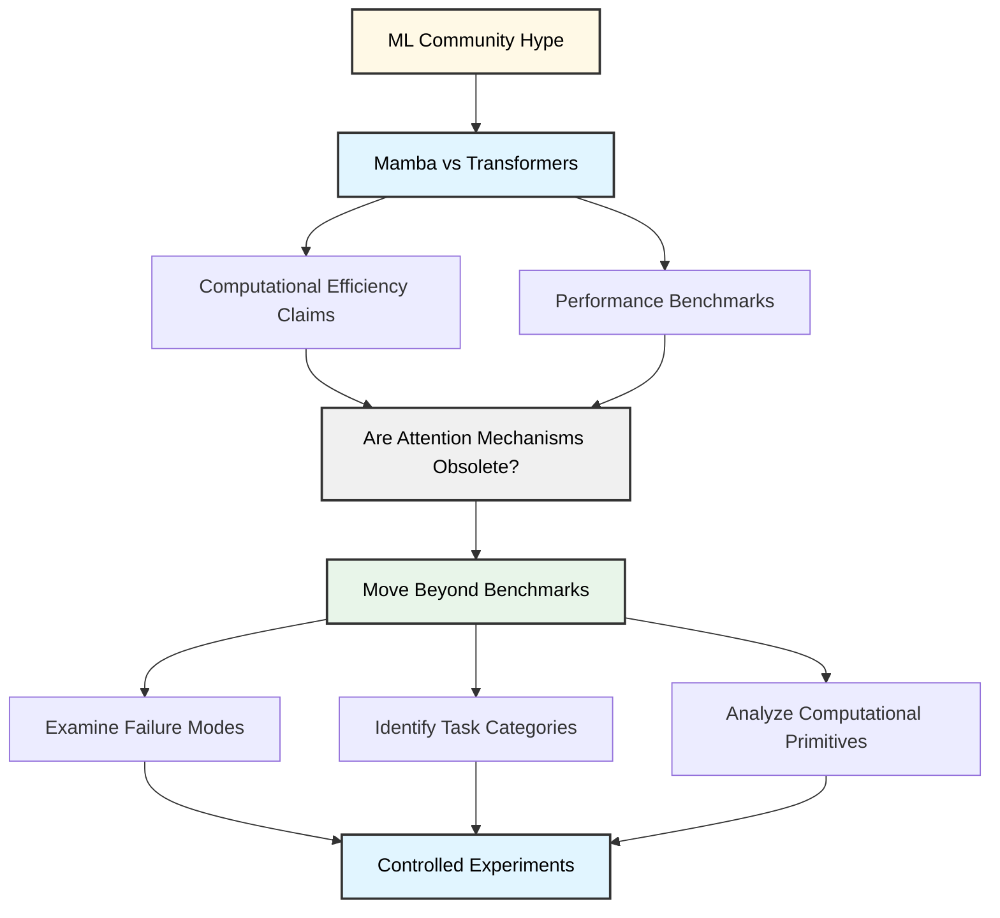
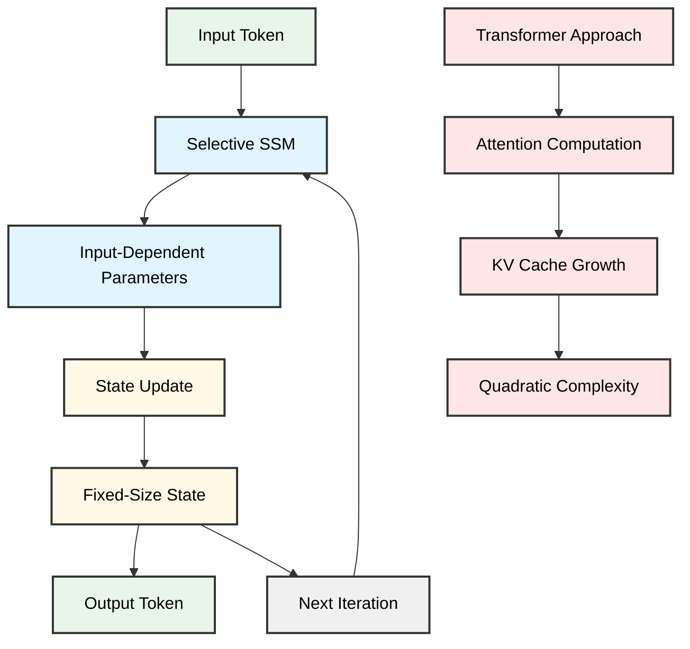
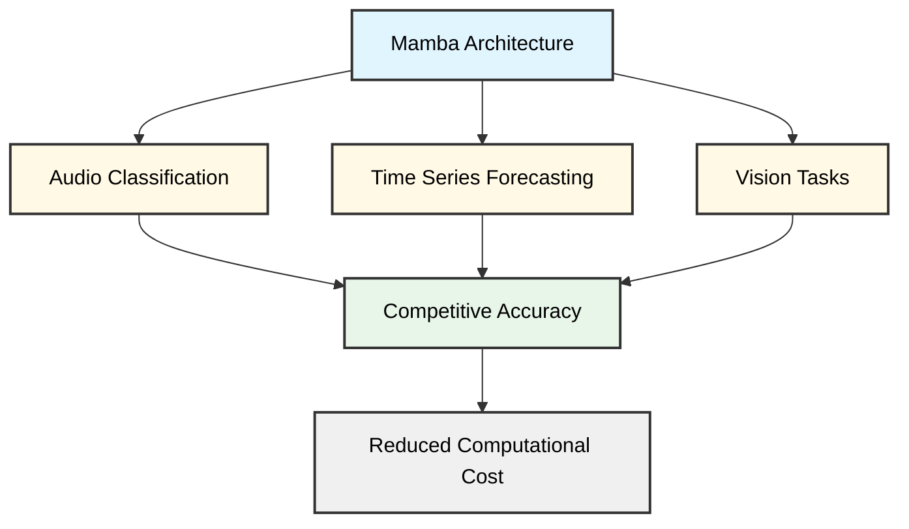
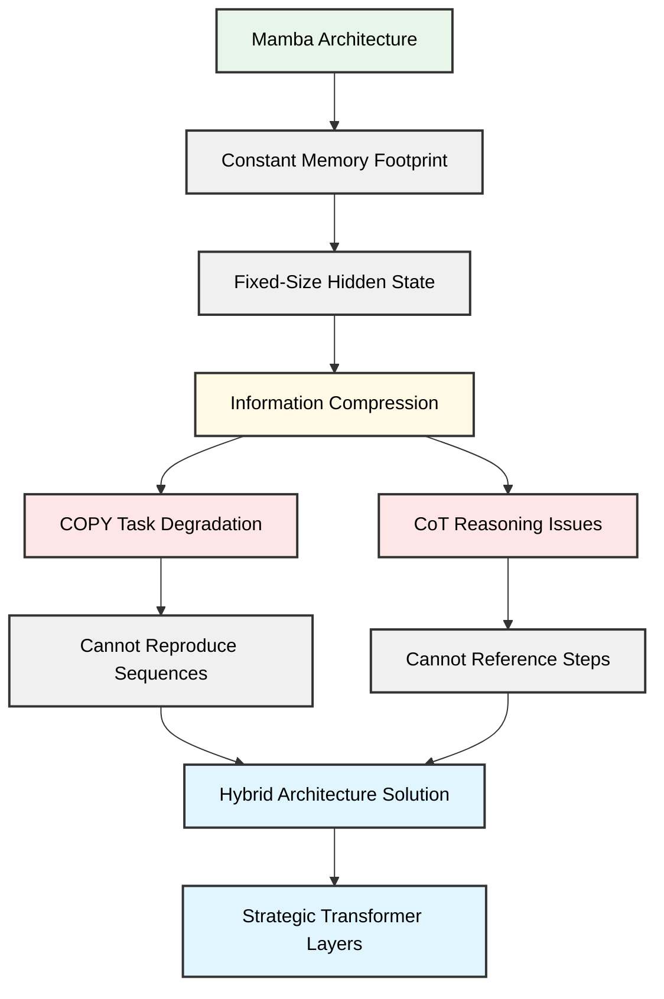
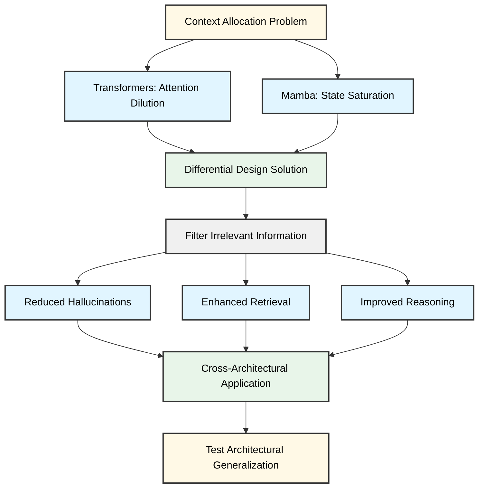
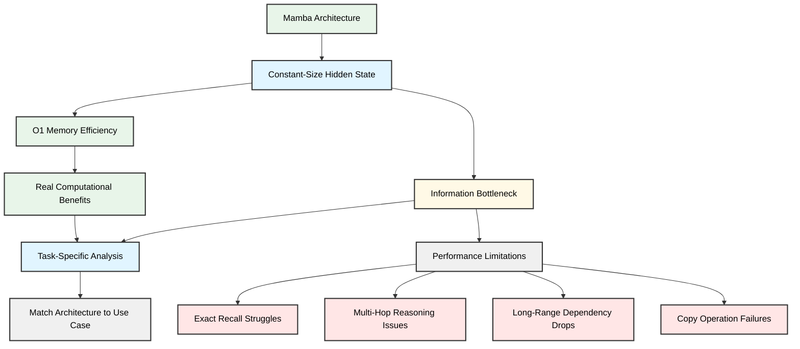
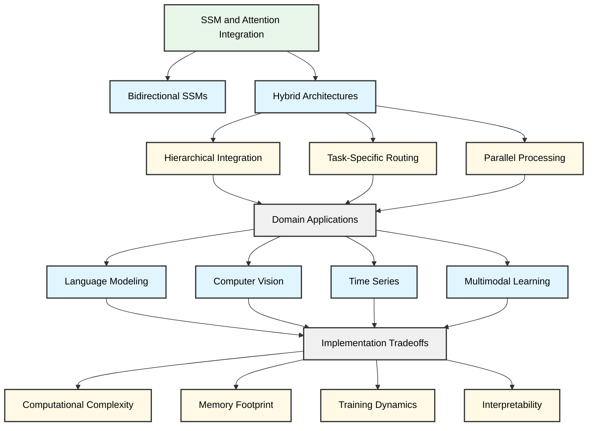
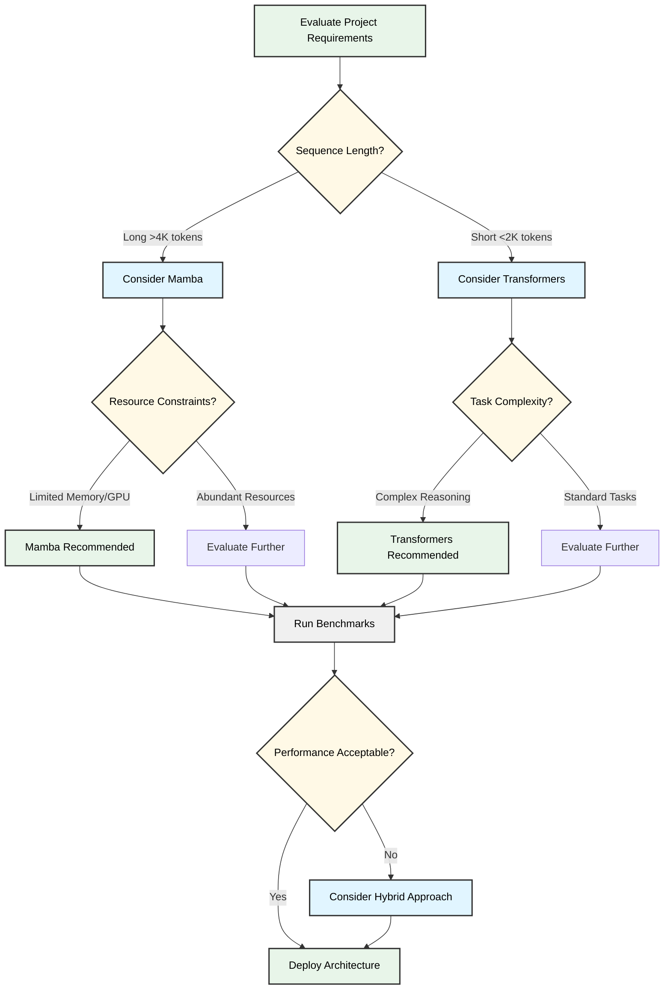
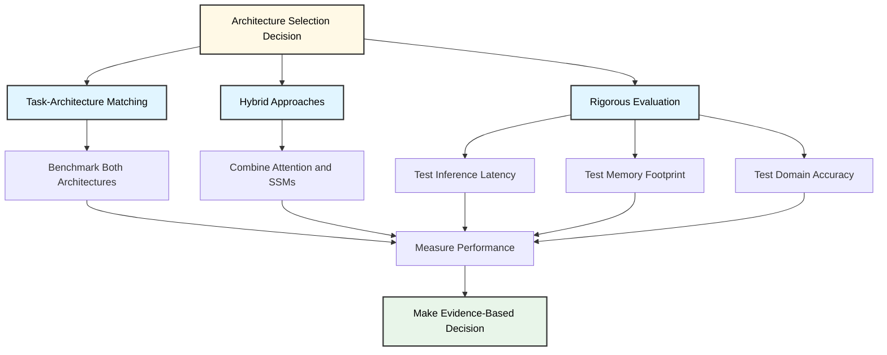

# State Space Models (Mamba) vs. Transformers: Is Attention Really Dead?

## Introduction: The Hype vs. Reality of State Space Models

The machine learning community has rallied around state space models, particularly Mamba, as a potential successor to attention-based architectures. Discussions across technical forums have featured claims of "infinite context" capabilities and assertions that these models fundamentally solve the computational bottlenecks that plague transformer-based systems. The narrative has been compelling: a new architecture that maintains constant memory during inference while matching or exceeding transformer performance across standard benchmarks.

Yet the architecture's fundamental differences from attention-based models warrant careful examination of their respective strengths and limitations. While transformers incur inference overhead that grows linearly with sequence length [acad_1_1], Mamba's constant inference size presents an appealing alternative for long-context applications. The critical question, however, extends beyond computational efficiency to the nature of the tasks themselves. These architectural tradeoffs motivate a deeper investigation into whether the mechanisms that enable Mamba's efficiency come with corresponding limitations in representational capacity.

This brings us to the central question: are attention mechanisms truly obsolete, or do they provide capabilities that state space models cannot replicate? The answer requires moving beyond benchmark scores to examine specific failure modes, task categories, and the fundamental computational primitives each architecture can efficiently express. Rather than accepting either the hype of complete obsolescence or dismissing Mamba's innovations entirely, we need empirical validation of where each approach excels and where it struggles.

The following analysis examines these questions through controlled experiments, focusing on tasks that stress-test the core assumptions underlying both architectures.

## Understanding State Space Models: The Mamba Architecture

Transformers have dominated sequence modeling through their self-attention mechanisms, but this architecture imposes quadratic computational complexity with sequence length and requires growing key-value caches during inference. Mamba addresses these limitations through selective state space mechanisms that achieve linear complexity while maintaining constant memory overhead during generation [acad_1_1].

## Core Principles: State Space Models

Mamba builds upon state space models (SSMs), a class of architectures that model sequences through continuous-time state representations. Traditional SSMs apply fixed linear transformations to map input sequences through hidden states, but Mamba introduces a critical innovation: **selective state space mechanisms**. Unlike conventional SSMs with static parameters, Mamba's parameters are input-dependent, allowing the model to dynamically filter and retain relevant information based on context. This selectivity is implemented through input-dependent parameterization of the SSM matrices, enabling the model to determine which information to propagate through its state.

The architecture achieves linear-time complexity O(n) with respect to sequence length [acad_3_2], processing each token through a structured recurrence rather than computing pairwise attention scores. This fundamental difference in computational primitive—recurrence versus attention—underlies Mamba's efficiency characteristics.

## Constant Inference State

One of Mamba's most significant advantages for deployment is its constant-size inference state [acad_1_1]. During autoregressive generation, the model maintains its entire context compressed into a fixed-dimensional state vector of size d (the model dimension), independent of context length. This contrasts sharply with Transformers, which accumulate key-value pairs for every token in the sequence, leading to memory requirements that scale linearly with context length.

This constant memory footprint enables Mamba to process arbitrarily long sequences during inference without the memory bottlenecks that constrain Transformer-based systems. However, this compression necessarily involves information loss, raising questions about whether the fixed-size state can adequately represent complex dependencies across very long contexts.

## Architectural Differences from Transformers

The divergence between Mamba and Transformers extends beyond computational complexity to fundamental differences in how they process sequential information:

- **Context aggregation**: Transformers compute explicit attention weights over all positions, enabling direct access to any prior token. Mamba compresses historical context into a fixed state vector updated recurrently, relying on the state to implicitly maintain relevant information.
- **Position handling**: Transformers require explicit positional encodings or embeddings to distinguish token positions. Mamba's recurrent structure inherently encodes temporal ordering through its state evolution [acad_4_1].
- **Information routing**: Transformers use learned attention patterns to determine which tokens interact. Mamba employs input-dependent gating mechanisms that modulate information flow through the state space, implementing selectivity through these dynamic gates.

These architectural distinctions create fundamentally different inductive biases. Transformers excel at tasks requiring explicit comparison or retrieval across distant positions, while Mamba's recurrent structure may be better suited for sequential dependencies that can be effectively compressed.

## Hardware-Aware Design

Mamba incorporates hardware-aware optimizations that exploit modern accelerator architectures [acad_3_2]. The model uses kernel fusion techniques to combine multiple operations into single GPU kernels, reducing memory bandwidth requirements. Its structured matrix operations enable parallel computation despite the recurrent formulation, allowing efficient training on parallel hardware while maintaining the constant-memory benefits during inference.

These implementation-level optimizations contribute significantly to Mamba's practical efficiency, though they complicate direct theoretical comparisons with Transformers. The performance characteristics depend not only on asymptotic complexity but also on how effectively the architecture maps to hardware capabilities.

## Implications for Capability

These fundamental differences determine when Mamba's efficiency gains may involve capability trade-offs. The constant-size state vector that enables efficient inference may limit the model's ability to maintain detailed information about long contexts. The recurrent information flow, while computationally efficient, may struggle with tasks requiring explicit reasoning over multiple distant elements simultaneously. Understanding which capabilities are preserved and which are compromised under Mamba's architectural constraints remains an open research question that requires systematic empirical investigation.

## Transformers' Computational Bottleneck: The Quadratic Scaling Problem

The self-attention mechanism that powers Transformers imposes a fundamental computational constraint: calculating attention scores between all token pairs in a sequence requires O(n²) operations, where n represents sequence length. This quadratic scaling creates substantial bottlenecks as sequences grow longer, affecting both training efficiency and inference costs. For context, a sequence of 1,000 tokens requires computing roughly 1 million attention scores per layer in a single attention head, and this cost multiplies across multiple heads and layers in production architectures.

## The Dual Challenge: Training and Inference

During training, the quadratic complexity manifests primarily through memory constraints. The attention matrix for each layer must be stored for backpropagation, limiting batch sizes and constraining addressable problem domains. A model processing sequences of 10,000 tokens faces 100x the memory requirements compared to 1,000-token sequences, assuming other factors remain constant.

Inference presents a different but equally significant challenge. During autoregressive generation, the computational cost per token grows linearly with sequence length, as each generated token must attend to all previous tokens. This results in quadratic cumulative cost for full sequence generation. For applications requiring real-time responses or processing extended contexts—such as document summarization, long-form dialogue, or multi-turn conversations—this overhead directly impacts user experience and deployment economics.

## Implications Across Domains

The quadratic scaling problem extends beyond natural language processing. Audio Spectrogram Transformers (ASTs), which have become the preferred architecture for audio classification tasks, face identical constraints when processing spectrograms that can span thousands of time-frequency bins [acad_1_3]. High-resolution vision transformers encounter similar challenges when processing images as sequences of patches, where a 512×512 image divided into 16×16 patches yields over 1,000 tokens.

These computational requirements create practical barriers for deploying transformer-based systems in resource-constrained environments, including edge devices, mobile applications, and scenarios requiring low-latency responses at scale.

## The Search for Alternatives

State space models (SSMs), particularly recent variants like Mamba, have emerged as promising alternatives by demonstrating competitive performance on language and vision tasks while avoiding the quadratic attention bottleneck [acad_1_3]. These architectures process sequences with linear computational complexity, potentially enabling efficient handling of significantly longer contexts without proportional increases in computational cost.

The central research question driving this exploration is whether self-attention—despite its computational overhead—provides irreplaceable modeling capabilities, or whether alternative architectures can achieve comparable or superior performance with fundamentally different computational profiles. Resolving this question has direct implications for deploying large-scale models in resource-constrained environments and expanding the practical sequence lengths that production systems can handle efficiently.

## Performance Analysis: Where Mamba Matches Transformers

Mamba's theoretical advantages in computational efficiency translate into measurable performance gains across diverse modalities. Analysis of recent empirical studies reveals three domains where Mamba-based architectures achieve parity with or exceed Transformer baselines while maintaining reduced computational overhead.

## Audio Classification

Audio Mamba demonstrates that self-attention mechanisms are not strictly necessary for competitive audio classification performance [acad_1_3]. The architecture addresses a fundamental limitation of Audio Spectrogram Transformers (ASTs): quadratic computational scaling with sequence length. By replacing self-attention with selective state space mechanisms, Audio Mamba achieves comparable accuracy on standard audio classification benchmarks while eliminating the quadratic bottleneck inherent to Transformer architectures. The bidirectional processing capability proves particularly valuable for capturing temporal dependencies in audio spectrograms, where both forward and backward context contribute to robust feature representations [acad_1_3].

## Long-Term Time Series Forecasting

Time series forecasting presents distinct challenges that expose limitations in Transformer architectures. Long-term time series forecasting (LTSF) requires models to capture extended temporal dependencies while managing the sparse informational density characteristic of many forecasting tasks—where meaningful patterns may be distributed across long sequences with substantial noise [acad_3_2][acad_4_2].

Bi-Mamba+ addresses these challenges through selective state space modeling with bidirectional processing. The selective capability allows the model to filter relevant temporal patterns from noise, while the bidirectional architecture leverages both historical context and future ground truth values available during training. This design achieves competitive performance with Transformer-based forecasting models on LTSF benchmarks, with the computational efficiency advantage becoming more pronounced as forecast horizons extend [acad_3_2][acad_4_2].

## Vision Tasks

Visual representation learning presents a unique challenge for state space models due to the spatial rather than sequential nature of image data. Vision Mamba demonstrates that SSMs can effectively handle position-sensitive visual data and capture the global context necessary for visual understanding [acad_4_1].

The key adaptation involves treating image patches as sequential tokens while maintaining bidirectional information flow to preserve spatial relationships. This approach enables Vision Mamba to match Transformer performance on vision benchmarks without relying on self-attention mechanisms. The architecture's ability to process visual data efficiently suggests that the computational patterns learned by SSMs can generalize beyond naturally sequential modalities [acad_4_1].

These empirical results across audio, temporal, and visual domains indicate that Mamba's selective state space approach provides a viable alternative to self-attention for tasks requiring long-range dependency modeling. The performance parity achieved in these diverse modalities, combined with reduced computational complexity on long sequences, positions Mamba as a practical choice for applications where sequence length creates computational constraints for Transformer architectures.

## Critical Limitations: Where Mamba Falls Short

While Mamba demonstrates impressive efficiency gains in many language modeling scenarios, recent research has identified specific task categories where the architecture exhibits notable performance degradation. Two areas of particular concern have emerged from recent evaluations: COPY tasks and chain-of-thought reasoning.

## The COPY Task Problem

COPY tasks—which require models to reproduce exact sequences from their input—represent a fundamental challenge for Mamba's architecture [acad_1_1]. In these tasks, the model must memorize and accurately reproduce strings of varying lengths, testing its ability to maintain perfect information fidelity.

The core issue stems from Mamba's constant memory footprint (O(1) memory complexity), which processes sequences through a fixed-size hidden state. Unlike Transformers, which can reference any previous token through attention mechanisms, Mamba compresses all historical information into this constant-size state representation. This compression introduces information loss that becomes particularly problematic when exact reproduction is required [acad_2_1].

Empirical evaluations reveal that Mamba's performance on COPY tasks degrades significantly as sequence length increases. While the architecture may handle shorter sequences adequately, longer sequences exceed the effective capacity of the compressed state, leading to reproduction errors. This limitation has direct implications for applications requiring exact recall, such as code generation (where syntax precision is critical), data extraction tasks, and any scenario demanding verbatim reproduction of input content.

The architecture's fundamental design—trading perfect recall for computational efficiency—means this limitation is not merely an implementation detail but an inherent characteristic of the state space model approach.

## Chain-of-Thought Reasoning Challenges

Chain-of-Thought (CoT) reasoning presents another significant challenge for Mamba architectures [acad_4_3]. CoT reasoning requires models to generate and reference intermediate reasoning steps, building complex solutions through sequential logical progression. This capability has become essential for modern LLMs tackling mathematical problems, logical puzzles, and multi-step analytical tasks.

The difficulty arises from Mamba's inability to efficiently reference earlier reasoning steps once they've been compressed into the hidden state. In multi-step math problems requiring reference to intermediate calculations, or in logical reasoning chains where conclusions depend on premises stated earlier, the compressed state representation may not preserve sufficient detail for accurate retrieval. Transformers, by contrast, can attend back to any previous token, allowing the model to "look up" earlier reasoning steps as needed.

Research indicates that Mamba underperforms relative to Transformers on benchmarks requiring explicit multi-step reasoning [acad_4_3]. The architecture's difficulty with CoT reasoning likely stems from the same fundamental constraint affecting COPY tasks: the compression of sequential information into a fixed-size state creates a bottleneck for tasks requiring precise recall of specific prior content.

## Implications for Real-World Deployments

These limitations carry significant practical implications for deploying Mamba-based models in production environments. Organizations evaluating Mamba should carefully consider their use case requirements:

**Task-Specific Evaluation**: Applications requiring exact reproduction (legal document processing, code completion, data transformation) or complex multi-step reasoning (mathematical problem-solving, logical analysis, debugging assistance) may not be suitable for pure Mamba architectures. Thorough benchmarking on representative tasks is essential before deployment.

**Hybrid Architectures**: The identification of these specific weaknesses has motivated exploration of hybrid architectures that combine Mamba's efficiency with Transformer layers at strategic points. These hybrid approaches aim to preserve computational advantages while addressing recall and reasoning limitations, though they introduce additional architectural complexity.

**Context Window Considerations**: While Mamba offers computational advantages for long sequences, the quality of information retention across those sequences may not match Transformer-based alternatives. Applications should distinguish between *processing* long contexts efficiently and *utilizing* long contexts effectively.

**Accuracy-Efficiency Tradeoffs**: The decision to adopt Mamba requires explicit acknowledgment of the accuracy-efficiency tradeoff. For latency-sensitive applications where approximate responses suffice, Mamba's efficiency gains may justify modest accuracy reductions. For applications demanding high precision, particularly in recall-intensive tasks, Transformers may remain the appropriate choice despite higher computational costs.

These limitations demonstrate that Mamba represents an optimization for specific use cases rather than a universal replacement for Transformer architectures. The architecture excels in scenarios where approximate pattern matching and generation suffice, but struggles where exact recall and explicit multi-step reasoning are required [acad_1_1][acad_4_3]. Understanding these boundaries is critical for making informed architectural decisions in LLM development and deployment.

## Addressing Context Allocation: The Differential Design Approach

Modern sequence models face a fundamental challenge: when processing long documents or extended contexts, they systematically overallocate computational resources to irrelevant information. This inefficiency affects both attention-based architectures like Transformers and state-space models like Mamba, though the mechanisms differ substantially [acad_1_2].

## The Context Allocation Problem

The overallocation of attention to irrelevant context creates noisy intermediate representations that compromise model performance through hallucinations, degraded retrieval, and weakened long-range reasoning [acad_1_2]. In Transformers, this manifests as attention dilution—the model's attention mechanism spreads probability mass across many tokens, including irrelevant ones, reducing the signal from truly important context. For Mamba, the issue appears differently: the model's fixed-size hidden state must compress all incoming information, and irrelevant context can saturate this limited representational capacity, effectively crowding out more relevant information.

These architectural differences raise an important question: can solutions designed for one architecture transfer to another with fundamentally different computational mechanisms?

## Differential Design as a Solution

Differential design techniques address context overallocation by implementing mechanisms that dynamically filter or downweight irrelevant information before it pollutes the model's representations. In Transformers, these approaches have demonstrated measurable improvements across several dimensions:

- **Reduced hallucinations** by preventing the model from incorporating spurious context into generated outputs
- **Enhanced retrieval capabilities** through better isolation of relevant information in long contexts
- **Improved long-range reasoning** by maintaining cleaner representations across extended sequences
- **Increased robustness** to adversarial or distracting context

Given Mamba's fundamentally different computational approach—processing sequences through state-space dynamics rather than attention—testing whether differential design principles transfer across architectures reveals critical insights about the generality of these techniques [acad_2_2].

## Cross-Architectural Applications

The exploration of differential design in Mamba serves as a test case for architectural generalization. If these techniques prove effective across both attention-based and state-space models, it suggests that context filtering represents a fundamental requirement for robust sequence modeling rather than an architecture-specific optimization. This has practical implications for hybrid architectures and future model designs that may combine elements from multiple paradigms.

The key technical challenge lies in adapting differential mechanisms to Mamba's state-space formulation. While Transformers can modulate attention weights directly, Mamba requires interventions in how information flows through its recurrent state updates—a substantially different implementation surface that tests the core principles underlying differential design.

## The 'Infinite Context' Myth: Social Media vs. Academic Reality

When Mamba was released, social media discussions framed it as solving the "infinite context" problem—a claim that research papers reveal to be significantly more nuanced [acad_1_1]. While Mamba does offer genuine computational advantages over Transformers, the gap between popular perception and empirical performance deserves careful examination.

## The Computational Efficiency Promise

Mamba's architecture maintains a constant-size hidden state during inference, meaning that processing token 1,000 requires the same memory footprint as processing token 1,000,000 [acad_2_1]. This O(1) memory per inference step contrasts sharply with Transformers, where attention mechanisms scale quadratically with sequence length. The computational benefits are real and measurable: Mamba can process longer sequences with substantially lower memory requirements and faster inference times.

However, constant inference size does not equate to unlimited context understanding. The fixed-size state creates an information bottleneck where earlier tokens must be compressed into a finite representation, regardless of sequence length.

## Performance Reality Checks

Empirical evaluations reveal task-specific limitations that social media discussions often overlook. Mamba exhibits measurable degradation in several categories [acad_4_3]:

- **Exact recall tasks**: When precise retrieval of specific information from earlier in the sequence is required, the compressed state representation struggles to maintain fidelity
- **Multi-hop reasoning**: Tasks requiring the model to connect information across distant parts of the sequence—such as linking a claim in paragraph 2 with supporting evidence in paragraph 47—expose the limitations of constant-size state compression. Information that must be retained and recombined across multiple reasoning steps tends to degrade as it passes through successive state updates
- **Long-range dependency resolution**: Syntactic or semantic relationships spanning thousands of tokens show performance drops compared to Transformer baselines
- **Copy operations**: Simple tasks requiring verbatim reproduction of earlier sequence content reveal fundamental constraints in information preservation

These limitations stem directly from the architectural trade-off: computational efficiency through state compression necessarily involves information loss that becomes more pronounced as sequences lengthen and task complexity increases.

## Reconciling Efficiency and Capability

The disconnect between computational metrics and task performance suggests two key considerations for practitioners:

**1. Efficiency gains are real but domain-specific.** Mamba's computational advantages materialize most clearly in scenarios where approximate understanding suffices—streaming data processing, document summarization, and tasks where local context dominates.

**2. Architecture selection requires task analysis.** Applications demanding precise long-range information retrieval or complex multi-hop reasoning may require Transformer architectures or hybrid approaches, despite their computational costs. The relevant question shifts from "which architecture is better?" to "which architectural trade-offs align with my task requirements?"

For production deployments, benchmark performance on representative tasks matters more than theoretical context length. A system that processes 100K tokens efficiently but fails at critical reasoning tasks offers little practical value over a more computationally expensive approach that succeeds. The path forward involves matching architectural strengths to specific use cases rather than seeking universal solutions—recognizing that the "infinite context" framing oversimplifies a landscape of nuanced trade-offs between computational efficiency and task-specific capability.

## Hybrid Approaches: The Future of Sequence Modeling

The choice between state space models and attention mechanisms is not necessarily binary. Recent research demonstrates that hybrid architectures combining both approaches may offer advantages over pure implementations, particularly when tailored to specific domains and task requirements.

## Bidirectional Processing in State Space Models

A key limitation of standard SSMs is their strictly causal, left-to-right processing, which contrasts with bidirectional attention mechanisms that can attend to both past and future context. Recent work has begun addressing this gap through bidirectional SSM variants.

Vision Mamba demonstrates that bidirectional state space processing can effectively handle position-sensitive visual data, showing that "the reliance on self-attention for visual representation learning is not necessary" when SSMs are properly adapted [acad_4_1]. For time series applications, Bi-Mamba+ extends this bidirectional capability to long-term forecasting tasks, leveraging selective input processing combined with parallel computing algorithms [acad_3_2][acad_4_2]. These bidirectional variants narrow the performance gap with attention-based models in tasks requiring global context, though the extent to which they fully replicate attention's capabilities remains an active research question.

The transition from unidirectional to bidirectional SSMs represents one strategy within a broader landscape of architectural integration approaches.

## Architectural Integration Strategies

Several patterns for combining SSMs and attention mechanisms have emerged in recent literature:

**Hierarchical Integration**: Models employ SSMs for local, intra-segment processing while reserving attention mechanisms for global, inter-segment interactions. This approach exploits SSMs' linear-time efficiency for local patterns while maintaining attention's global reasoning capabilities at reduced computational cost.

**Task-Specific Routing**: Architectures dynamically select between SSM and attention layers based on input characteristics or task requirements. This adaptive approach allows models to leverage each mechanism's strengths contextually, though it introduces complexity in determining optimal routing strategies.

**Parallel Processing**: Some designs process inputs through both SSM and attention pathways simultaneously, combining their outputs through learned fusion mechanisms. This redundancy can improve robustness but increases computational overhead.

The effectiveness of these patterns varies significantly across domains, and empirical validation remains limited for many proposed approaches.

## Domain-Specific Considerations

The optimal balance between SSMs and attention appears highly domain-dependent:

**Language Modeling**: SSMs demonstrate competitive performance on many language tasks, particularly for autoregressive generation where causal processing aligns naturally with the task structure. However, tasks requiring extensive cross-reference resolution or complex reasoning may still benefit from attention's explicit comparison mechanisms. Hybrid approaches might reserve attention for specific layers handling discourse-level phenomena while using SSMs for local linguistic processing.

**Computer Vision**: Visual tasks present unique challenges due to position-sensitivity and the need for spatial reasoning. Bidirectional SSMs like Vision Mamba show promise, but hybrid architectures that combine SSM-based feature extraction with attention-based spatial aggregation may prove beneficial for tasks requiring fine-grained spatial relationships [acad_4_1].

**Time Series Analysis**: Long-term forecasting benefits from SSMs' efficiency in processing extended sequences, as demonstrated by Bi-Mamba+ [acad_3_2]. However, modeling complex temporal dependencies with multiple interacting variables may require attention's ability to capture arbitrary relationships. Hybrid designs could employ SSMs for trend modeling while using sparse attention for capturing periodic patterns or anomalies.

**Multimodal Learning**: Cross-modal reasoning often requires comparing information across different modalities, a task naturally suited to attention. Hybrid architectures might use SSMs for within-modality processing and attention for cross-modal fusion.

## Implementation Tradeoffs

Hybrid architectures introduce several practical considerations:

**Computational Complexity**: While SSMs offer linear-time processing, adding attention components reintroduces quadratic complexity for those layers. The overall efficiency depends on the proportion and placement of attention mechanisms. Careful architectural design is crucial to maintain computational advantages.

**Memory Footprint**: Hybrid models must maintain both SSM state representations and attention key-value caches, potentially increasing memory requirements beyond pure implementations. This consideration is particularly relevant for deployment in resource-constrained environments.

**Training Dynamics**: Different optimization characteristics between SSMs and attention can complicate training. SSMs' recurrent nature may require different learning rate schedules or initialization strategies compared to attention layers within the same model.

**Interpretability**: Hybrid architectures compound the interpretability challenges of each mechanism. Understanding which component drives specific predictions becomes more difficult, though this may be acceptable in production systems prioritizing performance over explainability.

## Looking Forward

Rather than viewing SSMs and attention as competing alternatives, the field is moving toward understanding them as complementary tools with distinct strengths. The question is not which mechanism is superior in absolute terms, but rather how to optimally combine them for specific applications.

Future research directions include developing principled methods for determining optimal SSM-attention ratios, creating adaptive architectures that learn to route computation dynamically, and establishing theoretical frameworks for understanding when each mechanism provides advantages. Domain-specific benchmarks comparing pure and hybrid approaches across diverse tasks will be crucial for guiding architectural decisions.

The most promising path forward likely involves richer design spaces that treat SSMs and attention as architectural primitives to be composed thoughtfully, rather than monolithic choices that define entire model families.

## Practical Implications for ML Engineers and Researchers

## Practical Implications for ML Engineers and Researchers

The architectural choice between Mamba and Transformers requires careful evaluation of specific project requirements, resource constraints, and deployment contexts. This section provides actionable guidance for making informed decisions in research and production environments.

### Task-Specific Architecture Selection

**When to Choose Mamba:**

- **Long-sequence processing**: Applications requiring sequences beyond 4,096 tokens where Mamba's constant inference size provides clear advantages [acad_1_1]. This includes document analysis, genomic sequence processing, and extended conversation modeling.
- **Real-time inference requirements**: Scenarios demanding low-latency predictions where Transformer inference overhead grows linearly with sequence length [acad_1_1].
- **Resource-constrained deployments**: Edge devices, mobile applications, or environments with limited GPU memory where Mamba's linear computational complexity becomes decisive.
- **Time series forecasting**: Tasks involving long-term dependencies where Mamba's selective capability on input data and hardware-aware parallel computing can capture temporal patterns efficiently [acad_3_2].
- **Audio processing**: Applications where quadratic self-attention costs become prohibitive, particularly in audio representation learning tasks [acad_1_3].

**When to Choose Transformers:**

- **Short to medium sequences**: Tasks with sequences typically under 2,048 tokens where Transformer optimizations are mature and well-understood.
- **Complex reasoning tasks**: Applications requiring intricate chain-of-thought reasoning or precise token-level copying where empirical evidence suggests potential Mamba limitations [acad_1_1].
- **Transfer learning requirements**: Projects heavily dependent on pre-trained models where the Transformer ecosystem offers extensive checkpoint availability.
- **Established NLP tasks**: Standard classification, named entity recognition, or question answering where proven Transformer implementations reduce development risk.

### Computational Resource Constraints

Beyond sequence length, resource availability plays an equally critical role in architecture selection.

**Memory Considerations:**

- Transformers scale quadratically with sequence length for both memory and computation, making them prohibitive for sequences exceeding 8,192 tokens without specialized techniques like sparse attention.
- Mamba maintains approximately constant memory footprint regardless of sequence length [acad_1_1], enabling deployment in environments with strict memory budgets (e.g., under 16GB VRAM for inference).
- For batch processing scenarios, Mamba's memory efficiency allows larger batch sizes, potentially offsetting throughput differences.

**Computational Budget:**

- Training costs for Transformers increase substantially with sequence length, whereas Mamba's linear scaling provides more predictable resource requirements.
- Inference throughput depends on hardware optimization: Transformers benefit from extensive CUDA kernel optimizations, while Mamba implementations are still maturing.
- Consider amortized costs over the model lifecycle, not just initial training expenses.

### Production Deployment Checklist

Before committing to an architecture in production, evaluate these critical factors:

1. **Tooling maturity**: Does your deployment stack support the chosen architecture? Transformers integrate seamlessly with established frameworks (Hugging Face, ONNX Runtime), while Mamba may require custom implementation work.
2. **Monitoring and observability**: Transformers offer mature debugging tools and attention visualization capabilities. For Mamba deployments, ensure your team can implement custom monitoring for state space dynamics, or be prepared for less diagnostic visibility during troubleshooting.
3. **Model versioning and updates**: Frequent model updates favor architectures with abundant pre-trained checkpoints. If your use case requires regular retraining or fine-tuning, Transformer's extensive model zoo reduces iteration time.
4. **Latency requirements**: Profile both architectures on your target hardware with representative workloads. Theoretical complexity advantages don't always translate to practical latency improvements, especially for optimized Transformer implementations.
5. **Fallback strategies**: For critical production systems, consider whether you can maintain a Transformer baseline as fallback while experimenting with Mamba.
6. **Team expertise**: Assess whether your team has experience with state space models and recurrent architectures. Transformers' widespread adoption means easier access to expertise and community support.

### Hybrid Approaches

Practical deployments need not be binary. Consider these architectural combinations:

- **Staged processing**: Use Mamba for high-throughput preprocessing of long sequences, then apply Transformers for final reasoning stages requiring complex attention patterns.
- **Task-specific routing**: Deploy both architectures behind a routing layer that directs requests based on sequence length or task type.
- **Ensemble methods**: Combine predictions from both architectures for critical applications where accuracy justifies additional computational cost.

### Validation and Benchmarking

Regardless of theoretical considerations, empirical validation on your specific task is essential:

- **Create representative benchmarks**: Use actual data distributions and sequence lengths from your application, not just academic datasets.
- **Measure end-to-end latency**: Include preprocessing, inference, and postprocessing in performance comparisons.
- **Test across sequence lengths**: Evaluate performance degradation as sequences approach and exceed typical lengths.
- **Assess quality metrics**: Some tasks may show subtle quality differences that only emerge during thorough evaluation [acad_1_1].

### Ecosystem Maturity Considerations

The current state of tooling and community support differs significantly between architectures. While Mamba shows promise for specific use cases, the Transformer ecosystem provides substantial practical advantages in terms of pre-trained models, debugging tools, and production-ready implementations. For greenfield projects with clear long-sequence requirements and in-house ML expertise, Mamba warrants serious consideration. For projects requiring rapid deployment or extensive transfer learning, Transformers remain the pragmatic choice.

The optimal decision emerges from careful analysis of your specific constraints: choose Mamba for long sequences with resource constraints and when you have the engineering capacity for a less mature ecosystem; choose Transformers for established use cases requiring mature tooling and abundant pre-trained models. Always validate with empirical testing on your specific task before committing to production deployment.

## Conclusion: Is Attention Really Dead?

Based on current research, the short answer is no—though alternatives are emerging that challenge attention's dominance. The question requires examining the evidence rather than accepting binary claims about architectural superiority.

Mamba and similar state-space models have demonstrated impressive computational advantages, particularly for standard sequence modeling tasks where their constant-time inference overhead contrasts sharply with attention's linear scaling [acad_1_1]. These efficiency gains are substantial and matter significantly for resource-constrained deployments and production systems handling long sequences.

However, attention mechanisms maintain clear advantages for tasks requiring explicit token-level comparisons, complex reasoning patterns, and information retrieval across arbitrary sequence positions [acad_2_1]. Research has identified specific limitations in Mamba's performance on copying tasks and chain-of-thought reasoning scenarios where attention-based models excel [acad_4_3]. This creates inherent trade-offs without a clear winner.

## The Path Forward

Rather than viewing this as a competition between architectures, practitioners should focus on three key principles:

**Task-Architecture Matching**: Select architectures based on empirical performance for your specific use case rather than defaulting to popular choices. Benchmark both attention-based and alternative architectures on representative tasks before committing to a production architecture.

**Hybrid Approaches**: Consider architectures that combine attention mechanisms with efficient alternatives. Early research suggests that strategic placement of attention layers alongside state-space models may capture benefits from both paradigms while mitigating their respective weaknesses.

**Rigorous Evaluation**: Measure what matters for your application—whether that's inference latency, memory footprint, accuracy on domain-specific tasks, or training efficiency. Architectural decisions should be driven by quantitative evidence from controlled experiments rather than theoretical advantages or community momentum.

## Final Thoughts

Efficient alternatives like Mamba expand the architectural toolkit available to researchers and engineers, providing genuine options for scenarios where attention's computational costs become prohibitive. This diversification benefits the field by encouraging more nuanced thinking about architecture selection.

The question isn't whether attention is dead, but rather: which architectural properties matter most for specific problem domains? Some tasks benefit from attention's flexibility and explicit comparison mechanisms. Others achieve comparable results with more efficient alternatives. The future likely involves a diverse ecosystem of specialized architectures rather than a single dominant paradigm.

## References

- [Exploring the Limitations of Mamba in COPY and CoT Reasoning](http://arxiv.org/abs/2410.03810v3)
- [Differential Mamba](http://arxiv.org/abs/2507.06204v2)
- [Audio Mamba: Bidirectional State Space Model for Audio Representation Learning](http://arxiv.org/abs/2406.03344v1)
- [Exploring the Limitations of Mamba in COPY and CoT Reasoning](http://arxiv.org/abs/2410.03810v3)
- [Differential Mamba](http://arxiv.org/abs/2507.06204v2)
- [Bi-Mamba+: Bidirectional Mamba for Time Series Forecasting](http://arxiv.org/abs/2404.15772v3)
- [Vision Mamba: Efficient Visual Representation Learning with Bidirectional State Space Model](http://arxiv.org/abs/2401.09417v3)
- [Bi-Mamba+: Bidirectional Mamba for Time Series Forecasting](http://arxiv.org/abs/2404.15772v3)
- [Exploring the Limitations of Mamba in COPY and CoT Reasoning](http://arxiv.org/abs/2410.03810v3)
